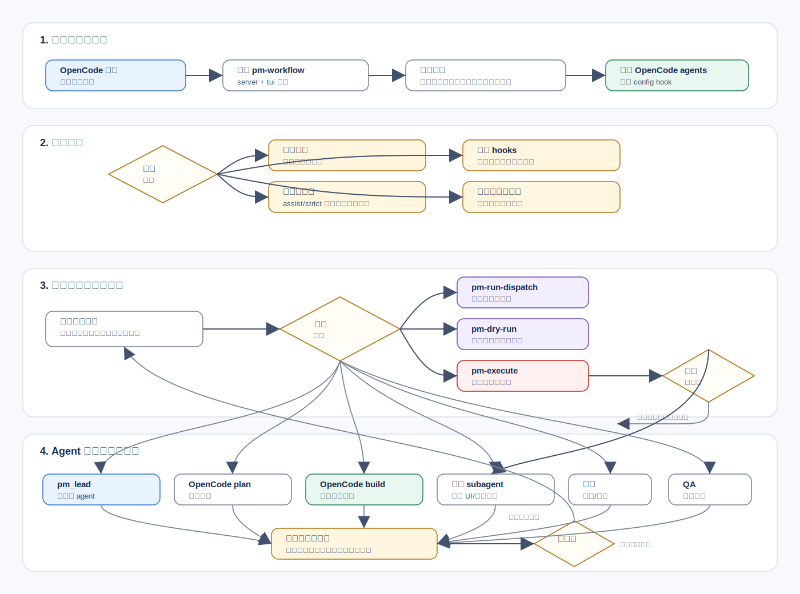
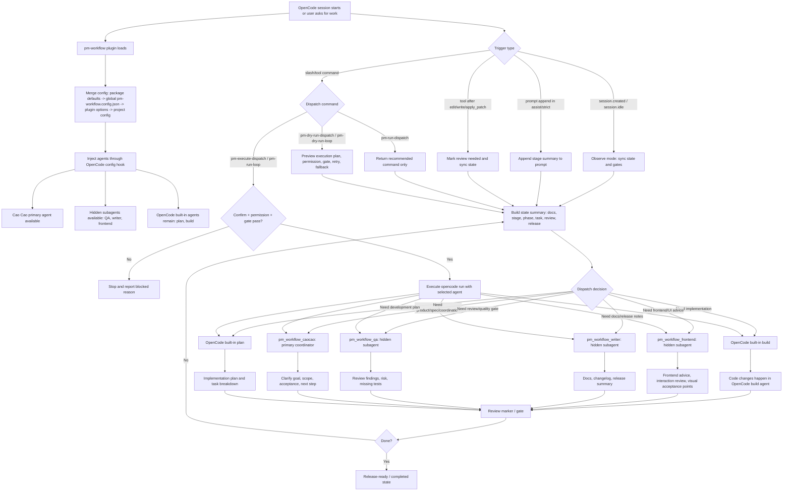

# opencode-pm-workflow

当前状态：已完成包内化、模块化拆分，并已具备独立 npm 插件运行、`dist` 构建与发布前校验能力。

## 目的

为 `pm-workflow` 提供一个可发布、可迁移、可独立安装的 OpenCode 插件包实现。

## 当前状态

当前包已经完成**核心运行逻辑的包内化与模块化拆分**，且已具备 `dist` 构建能力；运行时不再依赖本机 `skills/pm-workflow` 目录或其中的 Python 脚本：

- `src/server.ts` → 兼容转发入口，真实装配位于 `src/server/plugin.ts`
- `src/tui.ts` → 兼容转发入口，真实装配位于 `src/tui/plugin.ts`
- `src/shared.ts` → 纯 `re-export` 入口，真实逻辑已分散到 `core/*` 与 `orchestrator/*`

这样做的目标是固定 npm 包边界，让插件可以通过 `@walke/opencode-pm-workflow@latest` 独立安装与运行。

当前进度：

- server：已完成模块化（`runtime/hooks/tools/plugin`）
- tui：已完成模块化（`plugin/toasts/commands`）
- shared：已收敛为纯导出入口
- dist：已可本地构建
- 当前推荐运行入口：OpenCode `plugin` 配置中的 `@walke/opencode-pm-workflow@latest`
- legacy `plugins/pm-workflow-*.ts` 兼容壳仅用于旧环境迁移，推荐停用以避免重复加载

## 当前源码结构

当前源码已经按职责分层，后续排查时建议优先按下面的目录定位：

```text
src/
├─ core/
│  ├─ config.ts
│  ├─ doctor.ts
│  ├─ gates.ts
│  ├─ history.ts
│  ├─ migration.ts
│  ├─ project.ts
│  ├─ receipts.ts
│  ├─ recovery.ts
│  ├─ state.ts
│  └─ types.ts
├─ orchestrator/
│  ├─ plan.ts
│  ├─ prompts.ts
│  └─ safety.ts
├─ server/
│  ├─ plugin.ts
│  ├─ runtime.ts
│  ├─ hooks.ts
│  └─ tools/
│     ├─ admin-tools.ts
│     ├─ diagnostic-tools.ts
│     ├─ dispatch-tools.ts
│     ├─ execution-tools.ts
│     └─ state-tools.ts
├─ tui/
│  ├─ plugin.ts
│  ├─ toasts.ts
│  └─ commands.ts
├─ index.ts
├─ server.ts
├─ shared.ts
└─ tui.ts
```

说明：

- `src/server.ts` / `src/tui.ts` 现在是兼容转发入口
- `src/server/plugin.ts` / `src/tui/plugin.ts` 是实际装配入口
- `src/shared.ts` 是集中导出入口，不再承载内联实现

## 导出约定

当前包同时提供：

- 发布主入口：`dist/index.js`
- 发布子路径入口：`./server`、`./tui`、`./shared`
- 开发源码入口：`src/index.ts`
- 兼容导出：`default`

根入口会：

- 命名导出 `pmWorkflowServerPlugin`
- 命名导出 `pmWorkflowTuiPlugin`
- 保留 `default` 指向 server 入口，便于当前阶段兼容已有加载习惯

发布时实际暴露的是：

- `package.json#main -> ./dist/index.js`
- `package.json#exports -> ./dist/*`

因此：

- `src/*` 仅用于开发与本地调试
- `dist/*` 才是发布与消费入口

## 预期使用方式

未来可以按三种方式接入：

### 1. 当前开发态：源码入口

```json
{
  "plugin": [
    "./packages/opencode-pm-workflow/src/index.ts"
  ]
}
```

适用场景：

- 本地开发
- 调试包内源码
- 不依赖 `dist` 产物时

### 2. 本地构建态：dist 入口

先构建：

```bash
npm run --prefix packages/opencode-pm-workflow prepare-publish
```

然后使用构建产物：

```json
{
  "plugin": [
    "./packages/opencode-pm-workflow/dist/index.js"
  ]
}
```

### 3. 发布后按包名接入

```json
{
  "plugin": [
    "@walke/opencode-pm-workflow@latest"
  ]
}
```

插件会自动确保全局配置文件存在：

- `~/.config/opencode/pm-workflow.config.json`

运行时配置合并顺序为：

1. 包内默认值
2. `~/.config/opencode/pm-workflow.config.json`
3. OpenCode `opencode.json` 中传入的插件 options
4. 项目内 `.pm-workflow/config.json`

也可以在 OpenCode `opencode.json` 中传入可选初始配置；项目级配置仍可覆盖全局配置：

```json
{
  "$schema": "https://opencode.ai/config.json",
  "plugin": [
    [
      "@walke/opencode-pm-workflow@latest",
      {
        "config": {
          "automation": {
            "mode": "observe"
          },
          "permissions": {
            "allow_execute_tools": false,
            "allow_repair_tools": true,
            "allow_release_actions": false
          },
          "confirm": {
            "require_confirm_for_execute": true
          },
          "agents": {
            "enabled": true,
            "default_mode": "subagent",
            "dispatch_map": {
              "pm": "pm_workflow_caocao",
              "plan": "plan",
              "build": "build",
              "qa_engineer": "pm_workflow_qa",
              "writer": "pm_workflow_writer",
              "frontend": "pm_workflow_frontend"
            },
            "definitions": {
              "pm_workflow_caocao": {
                "model": "openai/gpt-5.5",
                "fallback_models": ["openai/gpt-5.4"],
                "mode": "primary",
                "temperature": 0.2,
                "description": "Cao Cao, pm-workflow primary coordinator",
                "prompt": "你是曹操（Cao Cao），pm-workflow 的主协调 agent。你取其决断、统筹、识人用人和风险判断之长：先辨形势，再定目标、边界、验收标准与推进路径。你表达直接、务实、清晰，重视结果与验证；不使用贬损、羞辱或嘲讽式表达。"
              },
              "pm_workflow_qa": {
                "model": "openai/gpt-5.4",
                "fallback_models": ["openai/gpt-5.4-mini"],
                "mode": "subagent",
                "hidden": true,
                "temperature": 0.1
              },
              "pm_workflow_writer": {
                "model": "openai/gpt-5.4-mini",
                "fallback_models": ["openai/gpt-5.4"],
                "mode": "subagent",
                "hidden": true,
                "temperature": 0.3
              },
              "pm_workflow_frontend": {
                "model": "openai/gpt-5.4-mini",
                "fallback_models": ["openai/gpt-5.4"],
                "mode": "subagent",
                "hidden": true,
                "temperature": 0.25
              }
            }
          },
          "docs": {
            "storage_mode": "project_scoped",
            "read_legacy": true,
            "write_legacy": false
          }
        }
      }
    ]
  ]
}
```

项目配置 schema 随包发布：

- `pm-workflow.schema.json`
- `pm-workflow.config.example.json`

插件会通过 OpenCode `config` hook 自动注入 workflow agents：

- `pm_workflow_caocao`
- `pm_workflow_qa`
- `pm_workflow_writer`
- `pm_workflow_frontend`

其中只有 `pm_workflow_caocao` 是 `primary`；`pm_workflow_qa`、`pm_workflow_writer`、`pm_workflow_frontend`
默认都是 `subagent` 且 `hidden: true`，供曹操通过 Task tool 委派使用，不作为常用主 agent 出现在用户切换流里。
`plan`、`build` 默认沿用 OpenCode 内置 agent，插件不再主动注入它们。`agents.dispatch_map`
负责把内部角色 `pm` / `qa_engineer` / `writer` / `frontend` 映射到这些 namespaced agent，避免覆盖用户已有的同名 agent。`fallback_models`
会生成 `pm_workflow_caocao_fallback_1` 这类 fallback agent，并接入 pm-workflow 的 fallback 执行策略。

## 在 OpenCode 中使用

### 1. 启用插件

在 OpenCode 的全局配置 `~/.config/opencode/opencode.json` 中加入插件：

```json
{
  "plugin": [
    "@walke/opencode-pm-workflow@latest"
  ]
}
```

插件启动后会自动创建或读取：

- `~/.config/opencode/pm-workflow.config.json`

这个文件用于配置 workflow agents 的模型、回退模型、权限、自动化模式和调度映射。项目内如果存在 `.pm-workflow/config.json`，会覆盖全局配置，适合给单个项目单独调模型或权限。

### 2. 推荐使用方式

日常使用时，可以直接在 OpenCode 中选择或呼叫 `pm_workflow_caocao`，把任务交给它：

```text
请作为 pm-workflow 主协调 agent，帮我把这个功能需求拆成产品目标、开发计划、验收标准和下一步调度建议。
```

曹操会做统筹判断，但不会亲自写代码。进入开发阶段时，工作流会把真正实现任务指向 OpenCode 内置 `build` agent；如果需要开发计划，则指向内置 `plan` agent。

### 3. 常用命令

这些命令可以在 OpenCode 的 slash command 或工具调用中使用：

| 命令 | 是否执行开发 | 用途 |
| --- | --- | --- |
| `/pm-get-state` | 否 | 查看当前 workflow 状态、阶段、文档和 review 状态 |
| `/pm-get-next-step` | 否 | 查看下一步建议 |
| `/pm-run-dispatch` | 否 | 生成推荐 agent 和推荐命令，但不执行 |
| `/pm-dry-run-dispatch` | 否 | 预演一次调度，检查 permission、gate、retry、fallback |
| `/pm-get-execution-plan` | 否 | 查看 ExecutionPlan v2，只读预览 |
| `/pm-safety-report` | 否 | 汇总权限、doctor、门禁、调度风险 |
| `/pm-permission-execute-on` | 否 | 尝试开启执行权限，仍受安全检查约束 |
| `/pm-permission-execute-off` | 否 | 关闭执行权限 |
| `/pm-execute-dispatch` | 是 | 通过确认、权限、门禁后执行推荐调度 |
| `/pm-run-loop` | 是 | 多步循环执行调度，默认应谨慎使用 |

默认建议先用 `/pm-dry-run-dispatch` 看清楚插件会调度谁，再决定是否执行。

### 4. 开发任务如何处理

当用户给出开发类任务时，插件的职责是“判断和编排”，不是替代开发 agent：

1. `pm_workflow_caocao` 先判断当前阶段、目标、验收标准和阻塞点。
2. 如果缺产品说明或开发计划，会建议先补齐文档或调用 OpenCode 内置 `plan`。
3. 如果已经可以开发，会把可执行 agent 指向 OpenCode 内置 `build`。
4. `pm_workflow_frontend` 只用于前端/UI/交互/视觉一致性建议，不作为实际开发执行者。
5. `pm_workflow_writer` 只用于文档、发布说明和交付摘要。
6. `pm_workflow_qa` 用于质量审查、风险和缺失测试检查。

因此，开发闭环通常是：

```text
用户需求 -> 曹操统筹 -> plan 做开发计划 -> build 写代码 -> QA/门禁检查 -> writer 整理交付文档
```

### 5. 安全执行规则

默认配置是安全模式：

```json
{
  "automation": { "mode": "observe" },
  "permissions": { "allow_execute_tools": false },
  "confirm": { "require_confirm_for_execute": true }
}
```

含义是：

- 插件会观察会话、同步状态、给出调度建议。
- 插件不会自动拉起开发任务。
- 即使调用执行工具，也必须先开启 `allow_execute_tools`，并通过确认、权限和 gate 检查。
- 代码改动后会触发 review marker，后续需要通过 QA/review gate 才能继续进入交付。

## 工作流流转图

这个插件和 OpenCode 的关系是：插件负责状态、门禁、调度建议和安全执行入口；OpenCode 负责会话、工具、内置 `plan` / `build`
agent 与真实模型调用。默认配置下，插件会观察并给出调度，不会擅自执行开发任务；只有显式调用执行工具并通过权限与确认门禁后，才会拉起对应 OpenCode agent。



按实际使用可以理解为：

1. 用户在 OpenCode 中提出任务，插件启动后先合并配置，并把 `pm_workflow_caocao`、`pm_workflow_qa`、`pm_workflow_writer`、`pm_workflow_frontend` 注入到 OpenCode。
2. 插件默认处于 `observe` 模式，只观察会话、同步状态、更新门禁，不会自己执行开发。
3. 当用户调用 `pm-run-dispatch` 或 `pm-dry-run-dispatch` 时，插件只给出“下一步该谁做、为什么、会不会被门禁拦住”的建议。
4. 只有调用 `pm-execute-dispatch` 或 `pm-run-loop`，并且确认、权限、门禁都通过时，插件才会真正执行 `opencode run --agent ...`。
5. 需求/统筹交给曹操，开发计划交给 OpenCode 内置 `plan`，真正写代码交给 OpenCode 内置 `build`，前端/文档/QA 三个 hidden subagent 只做专业辅助。
6. 代码改动后插件会标记 review gate，再由 QA/门禁检查形成闭环；未完成则重新调度，完成后进入 release-ready / completed 状态。



分工边界：

- `pm_workflow_caocao`：唯一 workflow primary agent，负责统筹、判断阶段、拆目标、看门禁。
- `pm_workflow_frontend`：隐藏 subagent，只做前端/UI/交互/视觉一致性建议，不作为开发执行者。
- `pm_workflow_writer`：隐藏 subagent，负责文档、发布说明、交付摘要。
- `pm_workflow_qa`：隐藏 subagent，负责审查、质量风险、验收与缺失测试。
- `plan` / `build`：OpenCode 内置 primary agents。真正开发实现交给 `build`，开发计划交给 `plan`。

## 构建命令

```bash
npm run --prefix packages/opencode-pm-workflow typecheck
npm run --prefix packages/opencode-pm-workflow build
npm run --prefix packages/opencode-pm-workflow prepare-publish
npm run --prefix packages/opencode-pm-workflow verify-release
npm run --prefix packages/opencode-pm-workflow check-auth
```

如果未来执行真正的：

```bash
npm publish
```

当前包还会自动触发：

```text
prepublishOnly -> npm run verify-release
```

这样可以避免在发布前跳过本地校验。

## 发布前自检

当前已验证通过：

```bash
npm run --prefix packages/opencode-pm-workflow typecheck
npm run --prefix packages/opencode-pm-workflow build
npm pack --dry-run --prefix packages/opencode-pm-workflow
```

当前与第二阶段演进相关的只读能力也已具备：

- `pm-get-execution-plan`：返回 `ExecutionPlan v2` 草案（只读，不执行）
- `pm-dry-run-dispatch`：当前 dry-run 输出会附带 `ExecutionPlan v2` 预览
- `pm-dry-run-loop`：当前 dry-run loop 输出会附带 `ExecutionPlan v2` 预览

真正执行发布前，还应先检查当前机器的 npm 登录态：

```bash
npm run --prefix packages/opencode-pm-workflow check-auth
```

`npm pack --dry-run` 当前包含：

- `dist/index.js`
- `dist/server.js`
- `dist/shared.js`
- `dist/tui.js`
- `README.md`
- `package.json`
- `tsconfig.json`
- `tsconfig.build.json`

这说明当前包已经具备本地发布前的基本面貌。

## 后续迁移建议

1. 推荐在 OpenCode `opencode.json` 中只保留 `@walke/opencode-pm-workflow@latest`。
2. 如果旧环境还存在 `plugins/pm-workflow-*.ts` 兼容壳，应停用或删除，避免和 npm 包重复加载。
3. 本包运行时不依赖 `skills/pm-workflow`；review gate、pre-commit check、feedback signal 检测均为包内实现。
4. 当前包已经具备本地 `dist` 构建能力，并已完成 `typecheck`、`verify-release` 与 `npm pack --dry-run` 验证。

## 第二阶段预览

当前已经开始第二阶段的低风险演进，但仍然保持“只读预览，不接管执行”：

- 已补齐 `DispatchPlan` / `DispatchCommand` / `ExecutionPlan` 显式类型
- 已提供 `buildExecutionPlan(projectDir, prompt?)`
- 已支持按 action 输出不同 step 模板：
  - `create-dev-plan`
  - `start-development`
  - `continue-development`
  - `run-code-review`
  - `prepare-release`
- 现阶段这些能力仅用于预览与 dry-run 展示，不会替换当前真实执行链路
