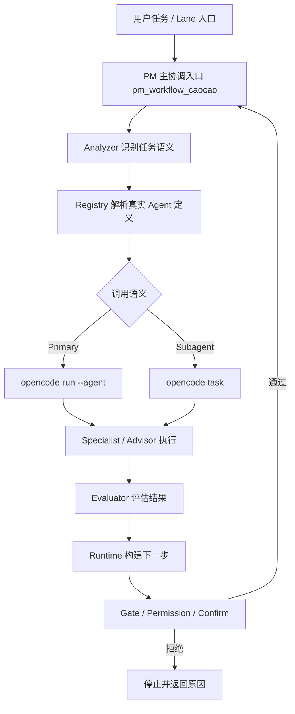
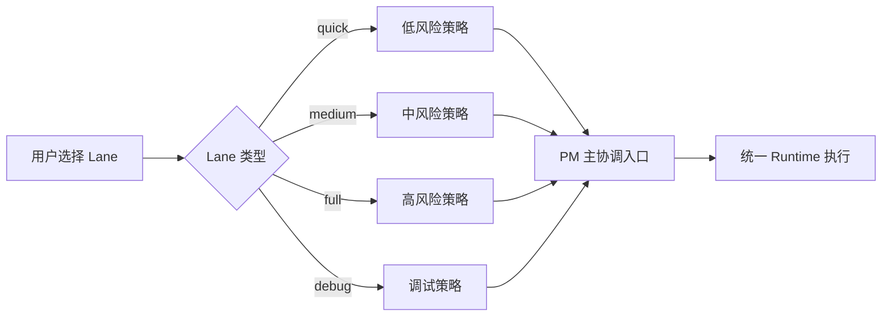
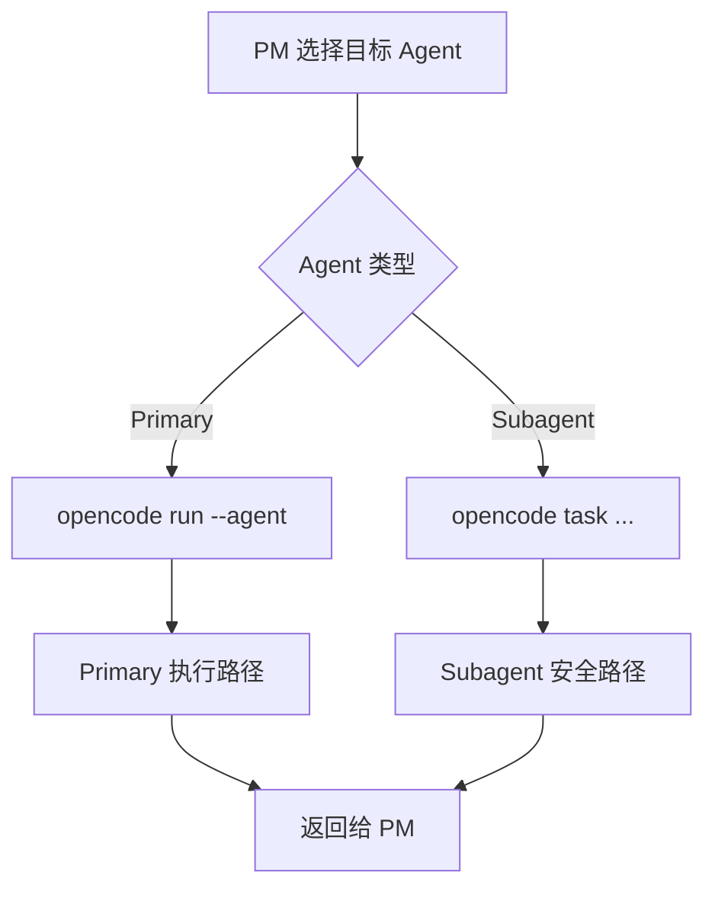
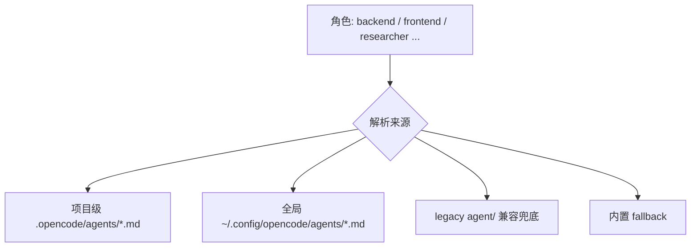

# pm-workflow 技术架构

## 1. 架构目标与原则

`pm-workflow` 的核心不是"多几个命令"，而是"让任务在统一运行时里受控推进"。

### 核心原则

- `pm_workflow_caocao` 是唯一主协调入口
- Command Lanes 是 UX facade，不是第二套 workflow engine
- Specialist agents 由 PM 统一编排，不作为 lane 的直接入口
- 自动续跑是有边界的自动化，不绕过 `gate / permission / confirm`
- **Workflow 识别的是稳定工作类型，不是 agent 文件名**
- **新增 agent 不等于新增语义角色**

## 2. 核心任务域与角色边界

核心任务域是 workflow 内部可被自动识别、自动分派、自动编排的稳定工作类型。当前保持在少量稳定集合内：

| 角色 | 职责 | 边界 |
| --- | --- | --- |
| `commander` | 总控编排、分析决策 | 不替代专业 agent 执行 |
| `plan` | 任务拆解、阶段安排、里程碑 | 不主导外部调研，不主导技术评审 |
| `frontend` | UI、交互、组件、可访问性 | 不替代后端实现 |
| `backend` | API、服务、鉴权、数据库、后端逻辑 | 不替代前端实现 |
| `researcher` | 资料搜索、调研、官方文档、方案对比 | 不做主实现，不做最终技术拍板 |
| `writer` | 文档、发布说明、交付摘要 | 不替代规划与实现 |
| `qa_engineer` | 测试、回归、代码审查、风险控制 | 不替代技术评审与实现 |
| `tech-lead` | 技术评审、架构审查、风险判断、取舍建议 | 只做"审"不做"做"，窄定义存在 |

### 角色判断速查

- 用户说**"帮我查"** → `researcher`
- 用户说**"帮我拆"** → `plan`
- 用户说**"帮我审"** → `tech-lead`
- 用户说**"帮我做页面"** → `frontend`
- 用户说**"帮我做接口"** → `backend`
- 用户说**"帮我写文档"** → `writer`
- 用户说**"帮我测试"** → `qa_engineer`

## 3. 总体分层：Analyzer / Registry / Runtime / Evaluator / Gate

系统分为 5 层，职责严格分离：

### Analyzer（语义判断层）
- 识别任务语义
- 归类到核心任务域
- 处理任务域边界冲突
- **不负责**决定真实 agent 文件来源、model、mode

### Registry（执行绑定层）
- 发现并解析 agent 定义
- 读取 frontmatter（model / mode / description）
- 生成 resolved agent definition
- 提供来源、优先级与 fallback 解释
- **不负责**新增任务语义或执行任务分类

### Runtime（执行编排层）
- 执行调度、handoff、回传、汇总
- 展示 resolved agent 信息
- mode-aware dispatch
- **不负责**二次任务分类或覆盖 Analyzer 结论

### Evaluator（结果评估层）
- 判断执行结果是否完成
- 推荐下一步 agent 与动作
- 产出 auto-continue 信号
- 生成 topology summary

### Gate（安全约束层）
- spec gate / plan gate / review gate / release gate
- permission 策略
- confirm 确认
- 阻止不安全推进

## 4. 总体架构图

## 5. Command Lane 与统一 Runtime 的关系

`pm-quick`、`pm-medium`、`pm-full`、`pm-debug` 的职责不是"自己决定怎么执行"，而是把一组显式策略送入统一 runtime。

| Lane | 风险 | 自动化姿态 | 适用场景 |
| --- | --- | --- | --- |
| `quick` | 低 | guided | 快速预览推进建议 |
| `medium` | 中 | assisted | 默认开发入口（推荐） |
| `full` | 高 | elevated | 完整执行与更强收敛 |
| `debug` | 调试 | assisted | reproduce / isolate / fix / verify |

### Lane 与 Runtime 关系图

## 6. Primary / Subagent 调度语义

从 `0.1.14` 开始，运行时会根据 agent 类型决定调用方式：

- **Primary Agent**（如 `pm_workflow_caocao`）：通过 `opencode run --agent <name>` 执行
- **Subagent**（如 `pm_workflow_frontend` / `pm_workflow_qa` / `pm_workflow_writer`）：通过 `opencode task ...` 执行

### 调度分流图

这样做的价值：
- 防止 subagent 被错误按 primary path 调用
- 保留 PM 统一汇总与再决策能力
- 避免 specialist 自己变成 lane 入口，破坏编排语义

## 7. Agent 定义来源与优先级

真实 agent 定义必须从以下位置解析，按优先级排列：

### 优先级顺序

### 关键约束

1. **项目级优先于全局级**
2. **`agents/` 为主路径，`agent/` 仅为兼容兜底**
3. **所有 agent 的说明、模型 id 都以 `opencode/agents/*.md` frontmatter 为准**
4. 外部定义缺失时采用"软依赖 + 内部兜底"

## 8. Compact Handoff 与结构化回传

`0.1.15` 收紧了 PM 向 specialist agent 的 handoff 结构：

### handoff packet 结构

- `mission`：任务目标，只保留一次核心意图
- `context`：关键背景，避免重复整段原始 prompt
- `scope`：明确应该做什么、不应该做什么
- `artifacts`：提示相关对象，而不是默认注入完整长文本
- `acceptance`：少量清晰的验收标准
- `responseFormat`：统一要求 specialist 按 `summary / verification / risk` 回传

### 价值

- 减少 handoff prompt 中的重复段落
- 降低把完整日志、完整 diff 直接灌入 subagent prompt 的概率
- 让 specialist 更清楚自己该做什么、不该做什么
- 让 evaluator 对结果做结构化判断

## 9. 当前架构约束

### 必须遵守

- 核心任务域保持少量且稳定
- 新增 agent 文件不自动扩张语义角色
- Analyzer 只优化已有角色边界，不默认扩容
- Runtime 不做二次语义分类
- 复合任务通过主 agent 编排解决，不通过新增角色解决

### 禁止事项

- 因新增 agent 文件、agent 名称、模型配置而新增核心任务域
- 平台型角色（android / ios / mobile）直接进入核心任务域
- 岗位型角色（principal-engineer / senior-frontend / architect）直接进入核心任务域
- 因模型能力差异新增语义角色
- 在多个层次重复维护角色真相

### 架构治理规则

> **pm-workflow 识别的是"工作类型"，不是"你当前配置了多少个 agent"。**
>
> **agent 可以增长，但核心语义不应随之线性膨胀。**
