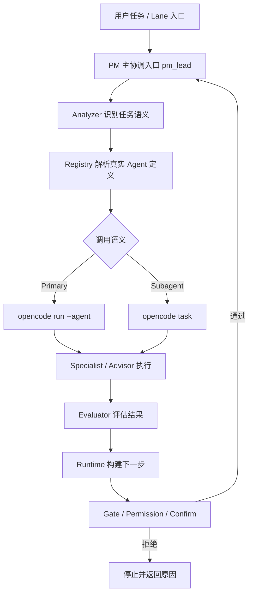
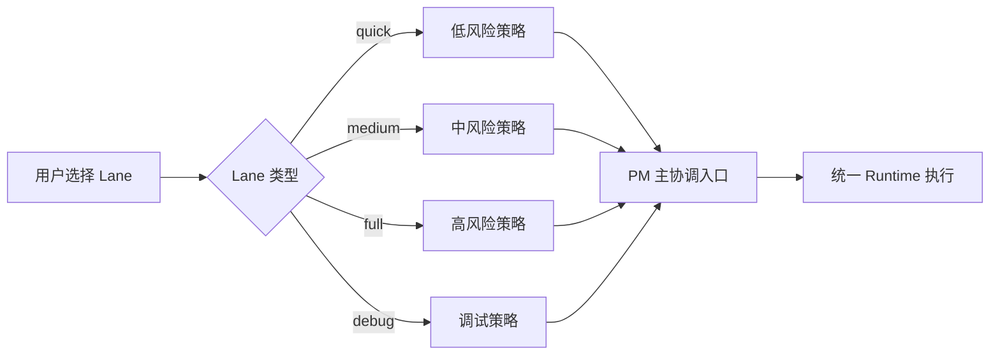
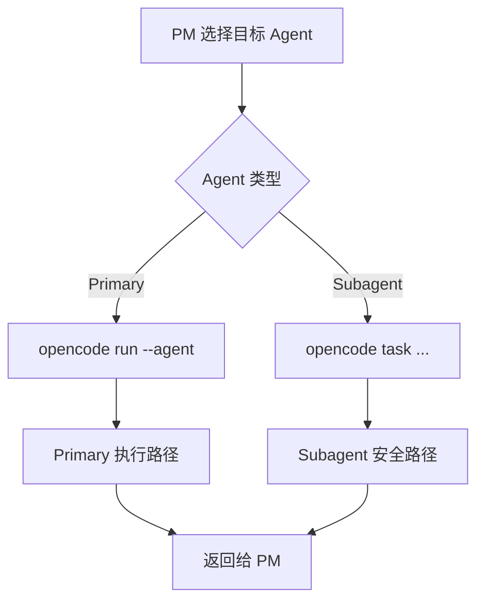
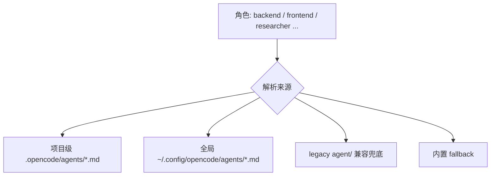

# pm-workflow 技术架构

## 1. 架构目标与原则

`pm-workflow` 的核心不是"多几个命令"，而是"让任务在统一运行时里受控推进"。

### 核心原则

- `pm_lead` 是唯一主协调入口
- Command Lanes 是 UX facade，不是第二套 workflow engine
- Specialist agents 由 PM 统一编排，不作为 lane 的直接入口
- 自动续跑是有边界的自动化，不绕过 `gate / permission / confirm`
- **Workflow 识别的是稳定工作类型，不是 agent 文件名**
- **新增 agent 不等于新增语义角色**

## 2. 核心任务域与角色边界

核心任务域是 workflow 内部可被自动识别、自动分派、自动编排的稳定工作类型。当前保持在少量稳定集合内：

| 角色 | 职责 | 边界 |
| --- | --- | --- |
| `pm_lead` | 主协调、分析决策、分派收敛 | 不替代专业 agent 执行 |
| `pm_advisor` | 任务拆解、阶段安排、风险识别 | 不主导外部调研，不主导技术评审 |
| `pm_frontend` | UI、交互、组件、可访问性 | 不替代后端实现 |
| `pm_backend` | API、服务、鉴权、数据库、后端逻辑 | 不替代前端实现 |
| `pm_researcher` | 资料搜索、调研、官方文档、方案对比 | 不做主实现，不做最终技术拍板 |
| `pm_reviewer` | 测试、回归、代码审查、发布说明 | 不替代技术评审与实现 |
| `tech-lead` | 技术评审、架构审查、风险判断、取舍建议 | 只做"审"不做"做"，窄定义存在 |

### 角色判断速查

- 用户说**"帮我查"** → `researcher`
- 用户说**"帮我拆"** → `plan`
- 用户说**"帮我审"** → `tech-lead`
- 用户说**"帮我做页面"** → `frontend`
- 用户说**"帮我做接口"** → `backend`
- 用户说**"帮我写文档"** → `writer`
- 用户说**"帮我测试"** → `qa_engineer`

## 3. 总体分层：Analyzer / Registry / Runtime / Evaluator / Gate

系统分为 5 层，职责严格分离：

### Analyzer（语义判断层）
- 识别任务语义
- 归类到核心任务域
- 处理任务域边界冲突
- **不负责**决定真实 agent 文件来源、model、mode

### Registry（执行绑定层）
- 发现并解析 agent 定义
- 读取 frontmatter（model / mode / description）
- 生成 resolved agent definition
- 提供来源、优先级与 fallback 解释
- **不负责**新增任务语义或执行任务分类

### Runtime（执行编排层）
- 执行调度、handoff、回传、汇总
- 展示 resolved agent 信息
- mode-aware dispatch
- **不负责**二次任务分类或覆盖 Analyzer 结论

### Evaluator（结果评估层）
- 判断执行结果是否完成
- 推荐下一步 agent 与动作
- 产出 auto-continue 信号
- 生成 topology summary

### Gate（安全约束层）
- spec gate / plan gate / review gate / release gate
- permission 策略
- confirm 确认
- 阻止不安全推进

## 4. 总体架构图

## 5. Command Lane 与统一 Runtime 的关系

`pm-quick`、`pm-medium`、`pm-full`、`pm-debug` 的职责不是"自己决定怎么执行"，而是把一组显式策略送入统一 runtime。

| Lane | 风险 | 自动化姿态 | 适用场景 |
| --- | --- | --- | --- |
| `quick` | 低 | guided | 快速预览推进建议 |
| `medium` | 中 | assisted | 默认开发入口（推荐） |
| `full` | 高 | elevated | 完整执行与更强收敛 |
| `debug` | 调试 | assisted | reproduce / isolate / fix / verify |

### Lane 与 Runtime 关系图

## 6. Primary / Subagent 调度语义

从 `0.1.14` 开始，运行时会根据 agent 类型决定调用方式：

- **Primary Agent**（如 `pm_lead`）：通过 `opencode run --agent <name>` 执行
- **Subagent**（如 `pm_frontend` / `pm_reviewer` / `pm_researcher`）：通过 `opencode task ...` 执行

### 调度分流图

这样做的价值：
- 防止 subagent 被错误按 primary path 调用
- 保留 PM 统一汇总与再决策能力
- 避免 specialist 自己变成 lane 入口，破坏编排语义

## 7. Agent 定义来源与优先级

真实 agent 定义必须从以下位置解析，按优先级排列：

### 优先级顺序

### 关键约束

1. **项目级优先于全局级**
2. **`agents/` 为主路径，`agent/` 仅为兼容兜底**
3. **所有 agent 的说明、模型 id 都以 `opencode/agents/*.md` frontmatter 为准**
4. 外部定义缺失时采用"软依赖 + 内部兜底"

## 8. Compact Handoff 与结构化回传

`0.1.15` 收紧了 PM 向 specialist agent 的 handoff 结构：

### handoff packet 结构

- `mission`：任务目标，只保留一次核心意图
- `context`：关键背景，避免重复整段原始 prompt
- `scope`：明确应该做什么、不应该做什么
- `artifacts`：提示相关对象，而不是默认注入完整长文本
- `acceptance`：少量清晰的验收标准
- `responseFormat`：统一要求 specialist 按 `summary / verification / risk` 回传

### 价值

- 减少 handoff prompt 中的重复段落
- 降低把完整日志、完整 diff 直接灌入 subagent prompt 的概率
- 让 specialist 更清楚自己该做什么、不该做什么
- 让 evaluator 对结果做结构化判断

## 9. 当前架构约束

### 必须遵守

- 核心任务域保持少量且稳定
- 新增 agent 文件不自动扩张语义角色
- Analyzer 只优化已有角色边界，不默认扩容
- Runtime 不做二次语义分类
- 复合任务通过主 agent 编排解决，不通过新增角色解决

### 禁止事项

- 因新增 agent 文件、agent 名称、模型配置而新增核心任务域
- 平台型角色（android / ios / mobile）直接进入核心任务域
- 岗位型角色（principal-engineer / senior-frontend / architect）直接进入核心任务域
- 因模型能力差异新增语义角色
- 在多个层次重复维护角色真相

### 架构治理规则

> **pm-workflow 识别的是"工作类型"，不是"你当前配置了多少个 agent"。**
>
> **agent 可以增长，但核心语义不应随之线性膨胀。**

## 10. ForegroundFallback：运行时模型降级

`0.4.0` 起新增"前台模型降级"机制，作为 Runtime 层的可选能力，与 Analyzer/Registry 严格分离。

### 触发条件

`executeDispatchCommand` 在子进程返回非 0 时，按下列模式扫描 stderr / stdout：

| 触发器 | 命中关键字（节选） |
| --- | --- |
| `rate_limit` | `429`、`rate-limit`、`too many requests`、`quota exceeded` |
| `timeout` | `timed out`、`504`、`gateway timeout`、`ETIMEDOUT` |
| `context_overflow` | `context length exceeded`、`maximum context`、`token limit` |
| `model_unavailable` | `503`、`service unavailable`、`model not found` |

仅当命中其一才触发；普通业务错误（语法错、权限错）不触发，避免误降级。

### 链路解析

`fallback.chains` 支持双索引：

- 按 **semantic agent**（如 `pm_lead`）配置
- 按 **具体 model id**（如 `cx/gpt-5.5`）配置

两者会按"先 agent、后 model"顺序合并去重，得到最终链路。`buildForegroundFallbackPlan` 在每次失败后给出 `nextModel`：链路尾部时返回 `undefined`，dispatch 停止重试。

### 与既有 fallback.agent_map 的关系

| 能力 | 切换粒度 | 数据来源 | 何时使用 |
| --- | --- | --- | --- |
| `fallback.agent_map` | 切换 **agent** 角色 | 旧字段（保留） | 角色不可用、子进程持续失败 |
| `fallback.chains` | 切换 **model** id | 新字段 | 当前模型限流 / 超时 / 不可用 |

两者相互独立：模型降级先发生，仍失败时才走 agent 降级。

## 11. 量化分派指引（agent stats）

`0.4.0` 起 handoff packet 新增可选字段 `agentStats`，仅在多候选场景注入。

### 字段语义

每张卡片包含：`agent / role / speed / cost / quality / delegateWhen / dontDelegateWhen / ruleOfThumb`。  
速度/成本/质量以 `pm_lead` 主协调为基准（相对值），便于 LLM 直接做"是否值得再委派"的对比。

### 注入策略（节省 token）

- `analysis.fallbackAgents.length === 0` → 不注入
- 单候选场景 → 不注入
- 多候选场景 → target 第一张，最多 3 张，按 fallback 顺序排序、去重

这样保证只在真正需要"再决策"时才付出 token 成本。

## 12. Auto-continue：Gate 之上的真自动化

`0.5.0` 起新增受控的自动续跑能力，作为 Runtime 层独立模块（`src/core/auto-continue.ts`）。

### 双总开关 + 5 步分层校验

`evaluateAutoContinueGuard` 会按下列顺序检查，任一不通过则 `allowed=false` 并返回原因：

1. `auto_continue.enabled`（默认 false）
2. `permissions.allow_auto_continue`（默认 false）
3. `auto_continue.max_steps` 步数上限
4. `auto_continue.cooldown_ms` 冷却（结合 state.auto_continue.last_step_at）
5. `auto_continue.require_clean_tree` 工作树干净

### 与既有 Gate 的关系

| 层级 | 作用 | 0.5.0 之前 | 0.5.0 之后 |
| --- | --- | --- | --- |
| Permission | 是否允许 dispatch 类工具执行 | 已有 | 已有 + 新增 `allow_auto_continue` 子开关 |
| Confirm | 显式 YES 才执行 | 已有 | 不变 |
| Execution Gate | spec / plan / review / release 序列 | 已有 | 不变 |
| Auto-continue Guard | 双总开关 + 冷却 + 步数 + 干净树 | 不存在 | 新增，叠加在 Gate 之上 |

Auto-continue Guard 永远不替换上述任何 Gate；它只是在所有现有约束都通过后**额外**叠加的"是否值得自动续跑下一步"判定。

### 反馈停止信号

`detectFeedbackStopSignal` 识别 specialist agent 输出里的中英文用户停止词（如"停下"、"不要再"、"stop"、"cancel"、"abort"）。命中即写 `auto_continue.aborted` 历史事件并退出链路。

### 与 oh-my-opencode-slim 的核心区别

slim 是"无 Gate 自动续跑"，pm-workflow 是"Gate 之上的自动续跑"。这是 pm-workflow 的核心安全承诺；任何后续演进**永不**改变这个边界。

## Change Log

| 日期 | 版本 | 变更 |
| --- | --- | --- |
| 2026-05-22 | 0.5.0 | 新增 §12 Auto-continue 章节；与 oh-my-opencode-slim 的边界写明 |
| 2026-05-22 | 0.4.0 | 新增 §10 ForegroundFallback 与 §11 量化分派指引；同步更新版本与原语清单 |
| 2026-05-09 | 0.2.0 | Agent 命名简化：更新核心任务域表、架构图、调度语义图中的 agent 名称 |
| 2026-05-09 | 0.1.18 | 新建：合并原 architecture-overview、routing、lane-mapping、subagent-migration 等文档，统一架构图与调用语义 |
