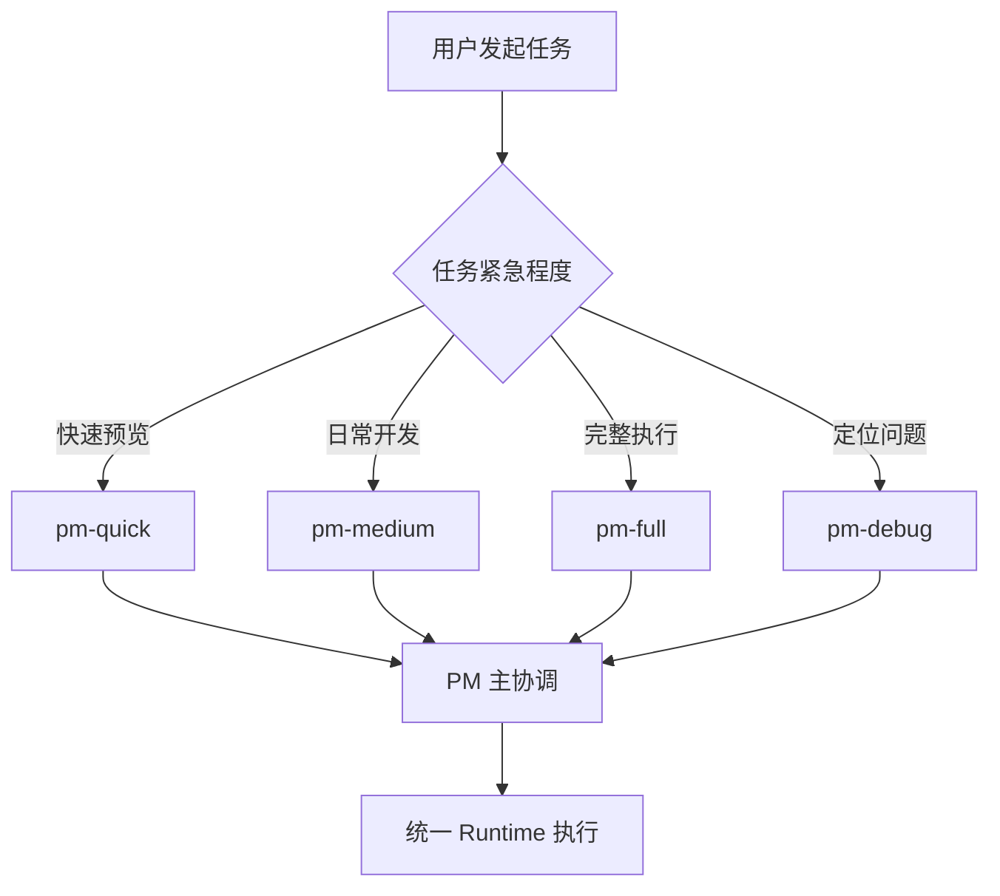
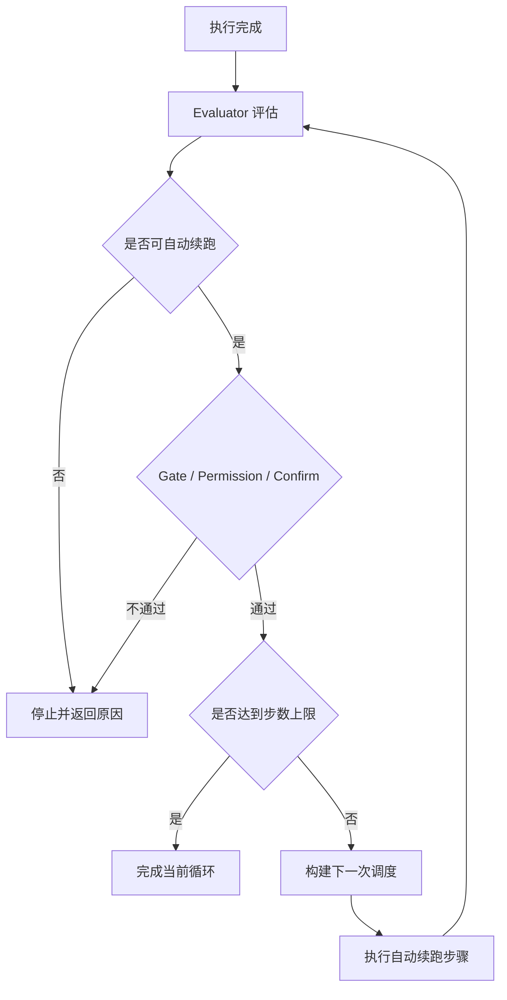
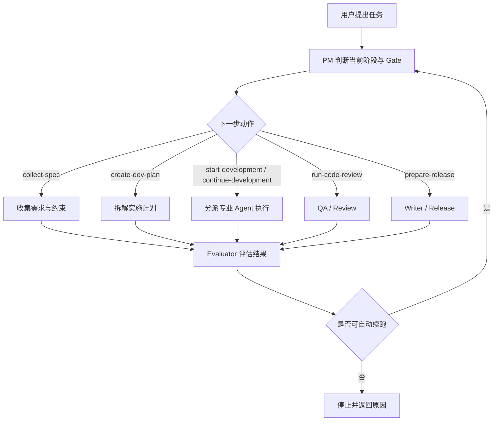

# pm-workflow 业务功能与任务流转

## 1. 解决什么问题

`pm-workflow` 要解决的核心问题是：**如何把一个模糊的任务想法，安全、可解释地推进到可验证的开发执行闭环。**

它不是单个命令，而是一套"按阶段推进"的调度框架。

## 2. 核心业务能力

| 能力 | 说明 |
| --- | --- |
| 状态判断 | 自动识别项目当前所处阶段 |
| Gate 约束 | 确保必要的 spec/plan/review 不被跳过 |
| 智能调度 | 按任务特征自动分派到合适的专业 agent |
| 执行编排 | PM 主协调，handoff 压缩，结果评估 |
| 自动续跑 | 0.5.0 起，Gate 之上的受控自动续跑：双总开关 + 5 步分层校验 + 反馈停止信号 |
| 运行时模型降级 | 0.4.0 起，限流/超时/溢出/不可用时按 chains 自动切换备用 model |
| 量化分派指引 | 0.4.0 起，多候选场景向 handoff 注入候选 agent 的速度/成本/质量对比卡片 |
| 启动健康检查 | 0.6.0 起，装配时校验 agents/tools/mcps 阈值并写入 log；不达标只 warn 不阻断 |
| Hook 注册去重 | 0.6.0 起，hot-reload 场景自动跳过重复装配，避免事件回调被多次触发 |
| 声明式路由 | 0.7.0 起，pm_lead → specialist 路由可在 agent markdown frontmatter 的 permission.task 字段声明，三级优先级（deny > allow/ask > fallback） |
| 离线 CLI（pmw） | 0.8.0 起，`pmw doctor / dispatch dry-run / state / history / verify`；CI / 服务器 / 没装 OpenCode 的环境也能用 |
| 本地回执 dashboard | 0.9.0 起，`pmw report` 生成单文件 HTML 报告（不联网、不上传），可视化 dispatch / fallback / auto-continue / routing 链路 |
| 诊断工具 | 状态查询、健康检查、执行回执 |

## 3. 阶段模型与 Gate

### 项目阶段

| 阶段 | 含义 | 进入条件 |
| --- | --- | --- |
| `idea` | 想法阶段 | 初始状态 |
| `spec_ready` | 需求已明确 | Product-Spec.md 存在 |
| `plan_ready` | 计划已就绪 | DEV-PLAN.md 存在 |
| `development` | 开发中 | 计划已确认，开始编码 |
| `review_pending` | 待审查 | 代码已修改，待 review |
| `release_ready` | 可发布 | 功能接近完成，通过 review |
| `released` | 已发布 | 正式发布完成 |
| `maintenance` | 维护中 | 发布后持续维护 |

### Gate 系统

| Gate | 检查内容 | 阻止什么 |
| --- | --- | --- |
| `spec gate` | Product-Spec.md 是否存在 | 跳过需求压缩直接开发 |
| `plan gate` | DEV-PLAN.md 是否存在 | 跳过计划直接编码 |
| `review gate` | 是否还有待 review 变更 | 未审查就发布 |
| `release gate` | 是否满足发布前条件 | 不满足条件就发布 |

## 4. Dispatch 动作与推荐下一步

系统根据当前 state + gates 推荐下一步动作：

| 动作 | 说明 | 适用阶段 |
| --- | --- | --- |
| `collect-spec` | 收集需求与约束 | idea |
| `create-dev-plan` | 拆解实施计划 | spec_ready |
| `start-development` | 开始开发 | plan_ready |
| `continue-development` | 继续开发 | development |
| `run-code-review` | 执行代码审查 | review_pending |
| `prepare-release` | 准备发布 | release_ready |
| `blocked` | 阻塞，需人工介入 | 任何阶段 |

## 5. Lane 的业务选择方式

| Lane | 风险 | 适用场景 |
| --- | --- | --- |
| `pm-quick` | 低 | 快速看一下系统建议，不做实际执行 |
| `pm-medium` | 中 | 日常开发默认入口，标准 review |
| `pm-full` | 高 | 需要完整执行与更强收敛的场景 |
| `pm-debug` | 调试 | 定位问题、复现 bug、验证修复 |

### Lane 选择流程图

## 6. Auto-Continue 与停止条件

### 自动续跑是什么

自动续跑是**受控延续**，不是绕过安全约束的自动执行。

### 触发条件

必须同时满足：

1. Evaluator 建议可以继续
2. Gate 检查通过
3. Permission 策略允许
4. Confirm 确认通过（若配置要求）
5. 未达到步数上限

### 停止条件

以下任一情况发生时，系统会停住并返回原因：

- 高风险操作
- 阻塞状态
- 信息不足
- Gate 不通过
- Permission 未授权
- 达到最大步数

### Auto-Continue 决策图

## 7. 复合任务编排方式

用户请求常常混合多种工作类型，例如：

> "帮我调研一下几种架构方案，并给个技术建议，顺便拆个落地计划"

这个请求同时包含：
- 调研 → `researcher`
- 判断 → `tech-lead`
- 拆解 → `plan`

### 正确处理方式

1. PM 主 agent 识别这是复合任务
2. 先调 `researcher` 收集信息
3. 再由 `tech-lead` 做评审判断
4. 最后 `plan` 生成落地步骤

### 错误处理方式

- 为每种组合场景新增一个新角色（如 `research-reviewer-planner`）
- 让某个角色越界承接所有工作

### 编排原则

> **复合任务应通过既有核心任务域的组合编排实现，而不是通过增加语义枚举实现。**

## 8. 任务流转流程图

下面这张图展示任务从进入到完成的完整流转路径：

### 流程图说明

1. **PM 是唯一主协调入口**：所有任务都先进入 PM 分析
2. **Commander 仅在复杂场景提供顾问建议**，然后回到 PM 主路径
3. **专业 agent 负责真实执行**：frontend / backend / researcher / writer / qa
4. **Evaluator 负责判断结果与下一步方向**
5. **系统支持低风险条件下的自动续跑**
6. **自动推进不会绕过 gate / permission / confirm**，不安全时会停住并返回原因

## 9. 角色边界硬对照表

| 角色 | 核心问题 | 主要产出 | 不该做什么 |
| --- | --- | --- | --- |
| `plan` | 接下来怎么推进 | 实施计划、任务拆解、里程碑 | 不主导外部调研，不主导技术评审 |
| `researcher` | 外面怎么做 / 官方怎么说 | 调研结论、资料汇总、方案对比 | 不做主实现，不做最终技术拍板 |
| `tech-lead` | 这个方案本身好不好 | 技术评审、架构判断、风险识别 | 不替代 planner，不替代 researcher |
| `frontend` | 页面/交互怎么做 | UI 组件、样式、交互实现 | 不替代后端实现 |
| `backend` | 接口/服务怎么做 | API、鉴权、数据库、服务逻辑 | 不替代前端实现 |
| `writer` | 怎么整理成文档 | README、发布说明、交付摘要 | 不替代规划与实现 |
| `qa_engineer` | 怎么验证质量 | 测试用例、回归验证、代码审查 | 不替代技术评审与实现 |

## Change Log

| 日期 | 版本 | 变更 |
| --- | --- | --- |
| 2026-05-22 | 0.9.0 | 业务能力表新增"本地回执 dashboard"项 |
| 2026-05-22 | 0.8.0 | 业务能力表新增"离线 CLI（pmw）"项 |
| 2026-05-22 | 0.7.0 | 业务能力表新增"声明式路由"项 |
| 2026-05-22 | 0.6.0 | 业务能力表新增"启动健康检查"与"Hook 注册去重"两项 |
| 2026-05-22 | 0.5.0 | 业务能力表的"自动续跑"项细化为"Gate 之上的受控自动续跑" |
| 2026-05-22 | 0.4.0 | 业务能力表新增"运行时模型降级"与"量化分派指引"两项 |
| 2026-05-09 | 0.1.18 | 新建：合并原 usage-flow、routing、lane-mapping 业务视角内容，统一业务流程图与角色边界表 |
