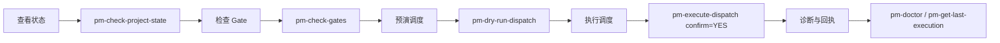

# pm-workflow 使用与运维手册

## 1. 安装与插件接入

### 安装

```bash
npm install @walke/opencode-pm-workflow
```

### OpenCode 接入

在 OpenCode 项目的插件入口中引用 server / TUI 包入口：

```ts
// plugins/pm-workflow-plugin.ts
export { default } from "@walke/opencode-pm-workflow/server";
```

```ts
// plugins/pm-workflow-plugin-tui.ts
export { default } from "@walke/opencode-pm-workflow/tui";
```

> 注意：不要同时加载源码入口、dist 入口和兼容壳，避免插件重复注册。

### 项目目录建议结构

```text
project/
├── .pm-workflow/
│   ├── state.json
│   ├── history.jsonl
│   ├── config.json
│   ├── docs/
│   │   ├── Product-Spec.md
│   │   ├── Design-Brief.md
│   │   └── DEV-PLAN.md
│   └── feedback/
└── <project-name>/
    ├── src/
    ├── package.json
    └── ...
```

## 2. 目录与配置文件

### 项目级配置

```text
.pm-workflow/config.json
```

### 全局默认配置

```text
~/.config/opencode/pm-workflow.config.json
```

### 示例配置

```text
pm-workflow.config.example.json
```

### Agent 定义目录

| 优先级 | 路径 | 说明 |
| --- | --- | --- |
| 1 | `.opencode/agents/*.md` | 项目级 agent 定义（最高优先） |
| 2 | `~/.config/opencode/agents/*.md` | 全局级 agent 定义 |
| 3 | `.opencode/agent/` | legacy 兼容兜底 |
| 4 | 内置 fallback | 内部默认定义 |

## 3. 常用 pm-* Tools

### 状态类工具

| 工具 | 说明 |
| --- | --- |
| `pm-get-state` | 返回 pm-workflow 当前状态快照 |
| `pm-check-project-state` | 检查当前项目所处阶段及下一步建议 |
| `pm-get-next-step` | 根据当前阶段返回下一步最合理的动作建议 |

### Gate 类工具

| 工具 | 说明 |
| --- | --- |
| `pm-check-gates` | 检查 spec/plan/review/release gate 状态 |
| `pm-check-review-gate` | 检查是否仍有待 review 的代码变更 |

### 调度类工具

| 工具 | 说明 |
| --- | --- |
| `pm-get-dispatch-plan` | 基于 state/gates 返回推荐 agent、动作和阻塞原因 |
| `pm-dry-run-dispatch` | 模拟执行调度，检查 permission/gate/retry/fallback，不执行命令 |
| `pm-run-dispatch` | 生成可直接执行的调度命令，并更新 last_agent |

### 执行类工具

| 工具 | 说明 |
| --- | --- |
| `pm-execute-dispatch` | 直接执行推荐命令，返回执行结果 |
| `pm-run-loop` | 按 state/gates 进行受控自动循环编排 |

### 回执类工具

| 工具 | 说明 |
| --- | --- |
| `pm-get-last-execution` | 查询最近一次 execution receipt |
| `pm-get-execution-receipt` | 查询 execution receipts 列表 |
| `pm-get-execution-by-id` | 按 execution_id 精确查询 |
| `pm-get-execution-summary` | 汇总 execution receipts 成功率 |

### 配置类工具

| 工具 | 说明 |
| --- | --- |
| `pm-get-config` | 读取当前 .pm-workflow/config.json 配置 |
| `pm-check-permissions` | 查看 permissions 策略当前状态 |
| `pm-set-permission` | 安全修改 permissions 中的单个布尔开关 |
| `pm-set-mode` | 设置自动介入模式（off/observe/assist/strict） |

### 诊断类工具

| 工具 | 说明 |
| --- | --- |
| `pm-doctor` | 检查 runtime 状态、配置、历史、gate 和 recovery 健康度 |
| `pm-doctor-repair` | 安全修复 state/config/history 与字段迁移 |
| `pm-safety-report` | 只读汇总权限、doctor、history 和 dry-run 安全状态 |

## 4. 推荐操作顺序



### 日常使用推荐流程

```bash
# 1. 查看当前项目状态
pm-check-project-state

# 2. 检查 gate 是否通过
pm-check-gates

# 3. 预演调度（不实际执行）
pm-dry-run-dispatch

# 4. 确认无误后执行
pm-execute-dispatch confirm=YES
```

### TUI 入口

TUI 启动后会自动显示：

1. **当前阶段**：如 `pm-workflow: 开发中`
2. **review gate**：当前是否存在待审查变更
3. **阶段引导**：推荐下一步动作

TUI 还支持以下 slash command：

- `/pm-workflow-status`
- `/pm-workflow-review-gate`
- `/pm-dispatch`
- `/pm-doctor`
- `/pm-history`
- `/pm-config`
- `/pm-permissions`
- `/pm-safety-report`
- `/pm-last-execution`
- `/pm-execution-summary`

## 5. 诊断与排障

### 常见问题

#### Q: 系统提示 "is a subagent, not a primary agent. Falling back to default agent"

**原因**：specialist agent 被错误地按 `opencode run --agent` primary 路径调用。

**解决**：确保 subagent 通过 `opencode task ...` 执行，而不是 primary path。

#### Q: `npm test` 报 `ERR_MODULE_NOT_FOUND: Cannot find module 'dist/index.js'`

**原因**：并行执行 `npm test` 与 `npm run build`，`build` 的 `clean` 清掉了 `dist/`。

**解决**：改为串行执行：

```bash
npm run build && npm test
```

#### Q: 找不到 `node` / `npm` 命令

**原因**：当前 shell 环境 PATH 不含 Homebrew 路径。

**解决**：显式前缀：

```bash
PATH="/opt/homebrew/bin:$PATH" npm run build
PATH="/opt/homebrew/bin:$PATH" npm test
```

#### Q: 文档路径失效

**原因**：旧文档已被删除，但某些地方仍引用旧路径。

**解决**：现行文档仅 5 篇：
- `README.md`
- `docs/01-技术架构.md`
- `docs/02-业务功能与任务流转.md`
- `docs/03-使用与运维手册.md`
- `docs/04-待办与演进清单.md`

### 健康检查

```bash
# 全面健康检查
pm-doctor

# 自动修复（安全操作）
pm-doctor-repair

# 安全审计
pm-safety-report
```

## 6. 发布前验证

```bash
npm run verify-release
```

等价于串行执行：

```bash
npm run typecheck
npm run build
npm run smoke
npm run pack-dry-run
```

## 7. 发布流程

```bash
# 1. 升版本号
npm version patch --no-git-tag-version

# 2. 发布前验证
npm run verify-release

# 3. 发布
npm publish --access public

# 4. 确认发布成功
npm view @walke/opencode-pm-workflow version
```

### 发布后检查

```bash
# 查看当前线上版本
npm view @walke/opencode-pm-workflow version

# 查看所有历史版本
npm view @walke/opencode-pm-workflow versions --json
```

## 8. FAQ

### Q: 我应该用哪个 Lane？

**A**：日常开发默认用 `pm-medium`。快速预览用 `pm-quick`，完整执行用 `pm-full`，定位问题用 `pm-debug`。

### Q: 新增一个 agent 文件后，需要改 pm-workflow 核心逻辑吗？

**A**：默认不需要。新 agent 先进入 `agents/*.md` 被 Registry 识别，只有当它代表一种**高频、稳定、边界清晰、值得自动分派**的新任务域时，才考虑进入核心语义层。

### Q: 自动续跑会绕过安全检查吗？

**A**：不会。自动续跑必须经过 Gate / Permission / Confirm 检查，只要任一条件不满足就会停住。

### Q: 模型配置应该怎么写？

**A**：模型清单只从全局 OpenCode 配置 `~/.config/opencode/opencode.json` 读取 `provider.*.models`。不要臆造模型 ID，也不要额外拼接 provider key。

### Q: 如何判断当前项目处于哪个阶段？

**A**：运行 `pm-check-project-state` 或 `pm-get-state`，系统会返回当前 stage 与下一步建议。

### Q: Todo 没完成怎么办？

**A**：每个 todo 必须完成，或标注 blocked 并说明原因。Todo 是过程终结标准，不是可选项。
