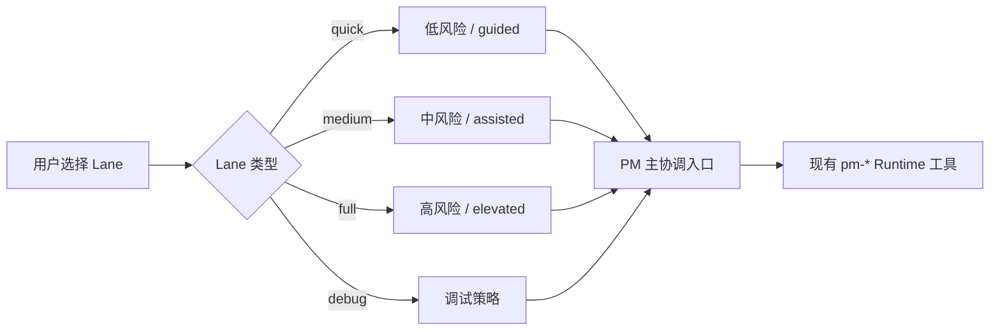

# Command Lane 映射

本文档说明 `pm-quick`、`pm-medium`、`pm-full`、`pm-debug` 四条入口与底层 runtime 的对应关系。

| Lane | 默认风险 | 自动化姿态 | Todo 策略 | 常见 Runtime 入口 |
| --- | --- | --- | --- | --- |
| `quick` | 低 | guided | 可选 | `pm-dry-run-dispatch` 或 `pm-execute-dispatch` |
| `medium` | 中 | assisted | 3 步以上推荐 | `pm-execute-dispatch` |
| `full` | 高 | elevated | 默认按阶段推进 | `pm-run-loop` |
| `debug` | 调试 | assisted | reproduce / isolate / fix / verify | `pm-run-loop` |

## 说明

- 这些 lanes 只是 **UX facade**，不是第二套 runtime。
- 所有真实执行仍然统一经过 `pm_workflow_caocao` 与现有 `pm-*` runtime tools。
- Specialist agent 由 PM 编排选择，不作为 lane 的直接入口。
- Lane context 会影响 risk、automation、review expectation、topology verbosity、todo policy 等调度元信息。

## 对应关系图

