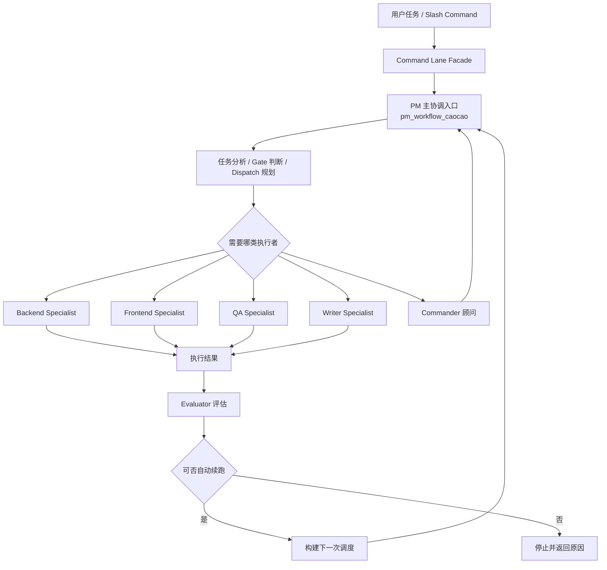
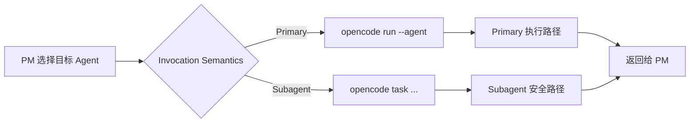
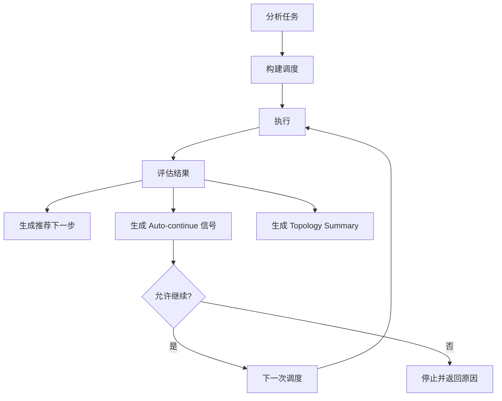

# pm-workflow 架构总览

## 目的

本文档从整体架构视角说明 `opencode-pm-workflow` 在 `0.1.15` 版本中的运行方式，重点回答下面 6 个问题：

1. Command Lane 到底是什么，和 runtime 是什么关系。
2. 为什么 `pm_workflow_caocao` 必须是唯一统一入口。
3. Specialist agents 为什么保持 subagent，而不是直接提升成 primary。
4. primary / subagent 调度语义如何分流。
5. compact handoff prompt 如何减少重复上下文与长文本注入。
6. evaluator、loop、topology summary 如何构成可解释闭环。

## 1. 总体架构原则

`pm-workflow` 的核心不是“多几个命令”，而是“让任务在统一运行时里受控推进”。

### 核心原则

- `pm_workflow_caocao` 是唯一主协调入口。
- Command Lanes 是 UX facade，不是第二套 workflow engine。
- Specialist agents 由 PM 统一编排，不作为 lane 的直接入口。
- Todo 由主 agent 主导，是推进闭环的一部分，但不替代 runtime。
- 自动续跑是有边界的自动化，不绕过 `gate / permission / confirm`。

## 2. 总体结构图

## 3. Command Lane 只是 Facade

`pm-quick`、`pm-medium`、`pm-full`、`pm-debug` 的职责不是“自己决定怎么执行”，而是把一组显式策略送入统一 runtime。

### Lane 负责的内容

- 风险等级（risk）
- 自动化姿态（automation）
- review expectation
- topology verbosity
- todo policy

### Lane 不负责的内容

- 不负责直接执行 specialist agent
- 不负责复制 dispatch / loop / evaluator 逻辑
- 不负责生成第二套 runtime 状态

## 4. 调度语义分流

从 `0.1.14` 开始，运行时会根据 agent 类型决定调用方式；`0.1.15` 延续这一语义，不改变 primary / subagent 分流规则。

### 这样做的原因

- 防止 subagent 被错误按 primary path 调用
- 保留 PM 统一汇总与再决策能力
- 避免 specialist 自己变成 lane 入口，破坏编排语义

## 5. Compact Handoff 与结构化回传

`0.1.15` 在不改变 runtime 主体编排逻辑的前提下，收紧了 PM 向 specialist agent 的 handoff 结构，目标是减少 token 浪费，并让 evaluator 更容易判断结果质量。

### handoff packet 的当前结构

- `mission`：只保留一次任务核心目标
- `context`：限制为少量关键背景，而不是重复整段原始 prompt
- `scope`：显式区分 should do / should not do
- `artifacts`：优先给出相关对象提示，而不是自动内嵌完整长文本
- `acceptance`：收敛成少量验收标准
- `responseFormat`：统一要求子 agent 返回 `summary / verification / risk`

### 这样做的价值

- 减少 handoff prompt 中的重复段落
- 降低把完整日志、完整 diff、完整文件正文直接灌入 subagent prompt 的概率
- 让 specialist 更清楚自己该做什么、不该做什么
- 让 evaluator 对结果做结构化判断，而不是只看“是否有一些输出”

## 6. 执行闭环与拓扑摘要

执行一次调度后，系统不仅要知道“成功还是失败”，还要知道：

- 下一步是什么
- 是否适合自动续跑
- 当前任务更像单任务、顺序、多支路还是混合拓扑

### Topology Summary 的价值

- 让 dry-run / execute / loop 输出更可解释
- 让 TUI toast 能展示这次调度是“单步”“顺序”还是“更复杂的组合”
- 为未来更强的多任务执行保留抽象层，但当前不过度建设

## 7. 推荐阅读顺序

如果你是第一次接触本项目，推荐按下面顺序阅读：

1. `README.md`
2. `docs/runbooks/pm-workflow-usage-flow.md`
3. `docs/dev/pm-workflow-architecture-overview.md`
4. `docs/dev/pm-workflow-routing-and-auto-continue.md`
5. `docs/dev/command-lane-mapping.md`
6. `docs/dev/subagent-dispatch-migration.md`

## Change Log

| 日期 | 变更 |
| --- | --- |
| 2026-05-08 | 更新到 0.1.15：补充 compact handoff packet、结构化 `summary / verification / risk` 回传约束，并将当前版本说明提升到 0.1.15。 |
| 2026-05-07 | 新增架构总览文档，统一说明 lane facade、PM 单入口、Primary/Subagent 调度分流、Evaluator 闭环与 Topology Summary。 |
