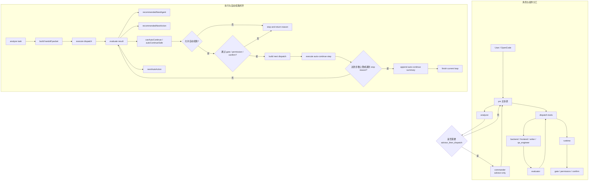

# pm-workflow 路由与自动续跑实现图

## Purpose

本文档用于从实现视角说明 `pm-workflow` 当前版本的任务路由方式与自动续跑闭环，帮助维护者理解 `pm`、`commander`、专业 agent、`evaluator`、`dispatch-tools`、`runtime`、`gate / permission / confirm` 之间的职责边界。

它不承担 README 总览图的职责，而是聚焦两个问题：

1. 系统内部由谁决定下一步。
2. 自动续跑如何在安全边界内运行，并在不安全时停住。

## Prerequisites

阅读本文前，建议先了解以下背景资料：

```text
docs/specs/2026-04-30-pm-workflow-diagrams-design.md
docs/specs/2026-04-30-pm-primary-routing-and-auto-continue-design.md
docs/specs/2026-04-30-pm-primary-routing-and-auto-continue-implementation-plan.md
docs/runbooks/pm-workflow-usage-flow.md
```

同时需要先建立这几个前提认知：

- `pm` 是唯一主协调入口。
- `commander` 只是 advisor-only，不是默认总入口。
- 专业 agent 负责真实执行。
- 自动续跑不是绕过安全约束，而是已有调度链路上的受控延续。

## Steps

## 1. 角色与组件分工

当前实现可以拆成下面几类角色与组件：

- `pm`：主协调入口，负责承接用户任务与组织下一步调度
- `analyzer`：识别任务特征，判断是否需要 advisor 参与
- `commander`：在复杂场景下提供顾问建议，再回到 `pm` 主路径
- `backend / frontend / writer / qa_engineer`：执行实际任务
- `evaluator`：根据执行结果推断下一步 agent、动作与 auto-continue 信号
- `dispatch-tools`：拼装、执行并汇总调度链结果
- `runtime`：构造下一跳 dispatch
- `gate / permission / confirm`：阻止不安全推进

## 2. 实现视角流程图

对应 SVG 成品：

```text
docs/pm-workflow-routing-auto-continue.svg
```



## 3. 如何理解这张图

### 3.1 主路径

主路径不是 `commander -> agent`，而是：

```text
User / OpenCode -> pm -> analyzer -> pm -> dispatch-tools -> 专业 agent -> evaluator
```

只有在 `analyzer` 判断需要复杂拆解建议时，`commander` 才会临时介入，并且介入后仍然回到 `pm` 主路径。

### 3.2 自动续跑信号来自哪里

`evaluator` 不只给“推荐下一步”，还会产出几类关键判断：

- `recommendedNextAgent`
- `recommendedNextAction`
- `canAutoContinue`
- `autoContinueSafe`
- `nextAutoAction`

这些信号共同决定：当前结果是否适合自动进入下一跳，而不是只做提示后停住。

### 3.3 为什么要把 gate 放在自动续跑链路里

因为系统目标不是“尽可能多跑”，而是“在可解释的安全边界内推进”。

所以即使 `evaluator` 认为可以继续，也必须再经过：

```text
gate
permission
confirm
```

只要任何一个条件不满足，就应该停在 `stop and return reason`，而不是继续推进。

## Examples

### 例 1：复杂任务需要顾问建议

```text
pm 接收任务
-> analyzer 判断需要 advisor_then_dispatch
-> commander 提供建议
-> 回到 pm
-> pm 继续分派给 backend / frontend / writer / qa_engineer
```

### 例 2：低风险结果触发自动续跑

```text
专业 agent 完成执行
-> evaluator 判断 canAutoContinue = true
-> gate / permission / confirm 通过
-> runtime 构造下一跳 dispatch
-> dispatch-tools 执行 auto-continue step
-> 汇总结果并决定是否继续或停住
```

## FAQ

### 为什么这张图不直接放进 README？

因为这张图包含实现字段与内部决策闭环，信息密度高，更适合维护者与贡献者，不适合第一次接触项目的读者。

### 为什么 commander 要单独弱化为 advisor-only？

因为这是当前架构语义里最容易被误解的点。如果不单独强调，读者会沿用旧理解，把它误当成默认总调度入口。

### 为什么 stop reason 要单独画出来？

因为“会停住且能解释原因”本身就是工作流设计的一部分，不是异常边缘情况。

## Troubleshooting

### 问题 1：图看起来还是像旧版 commander 主导工作流

排查方向：

- 是否把 `commander` 放到了主起点位置
- 是否缺少 `pm` 回收主路径的箭头
- 是否没有明确标注 `advisor-only`

### 问题 2：图看起来像只会推荐下一步，不会真正自动推进

排查方向：

- 是否缺少 `canAutoContinue / autoContinueSafe`
- 是否缺少 `build next dispatch`
- 是否缺少 `execute auto-continue step`

### 问题 3：图会让人误解自动推进绕过安全检查

排查方向：

- 是否把 `gate / permission / confirm` 放进自动续跑决策点
- 是否缺少 `stop and return reason`
- 是否让自动续跑箭头直接跳回执行节点而未经过判断

## Change Log

| 日期 | 变更 |
|---|---|
| 2026-04-30 | 新增实现视角文档，固化 pm 主协调、commander advisor-only 与 auto-continue 安全闭环 Mermaid 定稿。 |
