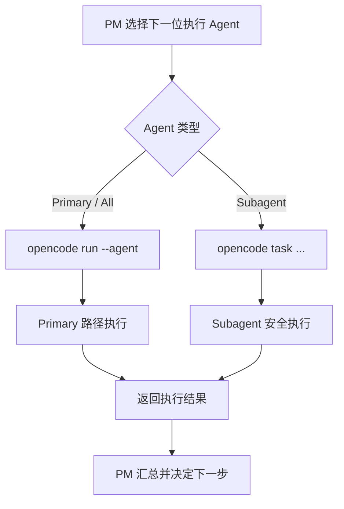

# Subagent 调度迁移说明

## 问题背景

有些 specialist agents 被配置为 **subagent**，但旧的 dispatch 流程仍然给它们构造了 **primary-path commands**。

这会导致两个问题：

1. subagent 被错误地按 primary agent 路径执行。
2. 运行时可能 fallback 到默认 agent，破坏原本的 PM 编排语义。

## 迁移原则

1. 从 workflow config 中解析 agent 的 **invocation semantics**。
2. 只有 `primary` 或 `all` 类型 agent 才走 primary-path commands。
3. `subagent` 类型 agent 必须走 subagent-safe 的 task / session 路径。
4. 保持 PM 作为唯一 lane 入口。

## 为什么这很重要

- 它能防止 specialist subagent 被错误地走 primary path。
- 它保留 `pm_workflow_caocao` 作为唯一 orchestrator。
- 它让 lane commands 继续保持“薄 UX 包装层”，而不是演变成第二套 runtime。

## 迁移后的调用语义图

