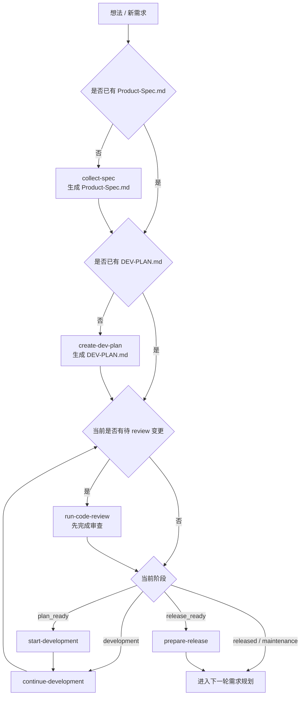
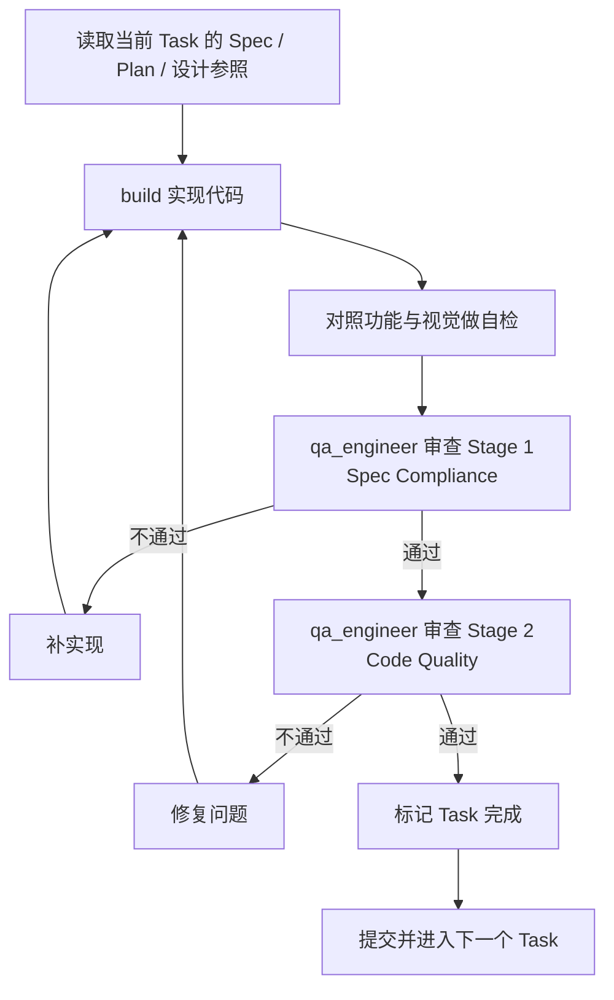
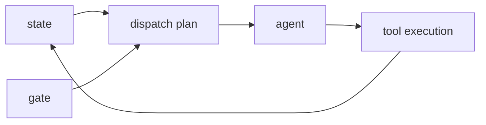

# pm-workflow 使用说明与任务流转手册

## Purpose

本文说明 `pm-workflow` 扩展的用途、接入方式、阶段流转规则，以及在 OpenCode 中如何用它推进一个任务从想法到发布。

这份文档重点回答 4 个问题：

1. 这个扩展是什么。
2. 我应该怎么开始用。
3. 当前项目处在哪个阶段。
4. 一个任务会如何在 `idea/spec/plan/dev/review/release` 之间流转。

## Prerequisites

开始前建议确认以下前提：

### 1. 插件已成功接入

当前推荐接入方式是继续使用现有兼容壳：

```text
plugins/pm-workflow-plugin.ts
plugins/pm-workflow-plugin-tui.ts
plugins/pm-workflow-shared.ts
```

说明：

- 兼容壳会把实际运行转发到已发布包 `@weekii/opencode-pm-workflow`。
- 不要再同时把 `packages/opencode-pm-workflow/src/index.ts`、`dist/index.js` 或包根入口重复写进 `opencode.json` / `tui.json`，否则会重复加载。

### 2. 项目目录建议结构

```text
project/
├── .pm-workflow/
│   ├── state.json
│   ├── history.jsonl
│   ├── config.json
│   ├── docs/
│   │   ├── Product-Spec.md
│   │   ├── Design-Brief.md
│   │   └── DEV-PLAN.md
│   └── feedback/
└── <project-name>/
    ├── src/
    ├── package.json
    └── ...
```

### 3. 基础运行条件

- 当前目录应是目标项目根目录。
- 已具备 OpenCode 基本运行环境。
- 若要执行发布动作，还需要可用的发布权限与对应平台凭据。

### 4. 可选但推荐的能力

- `qa_engineer`：用于 review 阶段。
- 设计工具或设计稿：用于 UI 对齐。
- 构建与测试命令：用于阶段完成验证。

## Steps

## 1. 先理解 pm-workflow 在做什么

`pm-workflow` 不是单个命令，而是一套“按阶段推进”的调度框架。它会根据项目当前状态，给出下一步推荐动作。

核心对象有 4 类：

### State

`state` 表示“项目现在在哪”。

典型阶段包括：

- `idea`
- `spec_ready`
- `plan_ready`
- `development`
- `review_pending`
- `release_ready`
- `released`
- `maintenance`

### Gate

`gate` 表示“这个阶段能不能继续往前走”。

常见 gate：

- `spec gate`：是否已经有 `Product-Spec.md`
- `plan gate`：是否已经有 `DEV-PLAN.md`
- `review gate`：是否还存在待 review 的代码变更
- `release gate`：是否满足发布前条件

### Dispatch

`dispatch` 表示“系统建议下一步做什么”。

典型动作：

- `collect-spec`
- `create-dev-plan`
- `start-development`
- `continue-development`
- `run-code-review`
- `prepare-release`
- `blocked`

### Agent

`agent` 表示“这一步更适合谁来做”。

当前主要角色：

- `pm`：需求收集、阶段判断、路线推进
- `plan`：开发计划整理
- `build`：实现与修复
- `qa_engineer`：代码审查与质量验证
- `writer`：文档整理

## 2. 启动后先看三类提示

TUI 启动后，默认会看到三类 toast：

1. **当前阶段**：比如 `pm-workflow: 开发中`
2. **review gate**：当前是否存在待审查变更
3. **阶段引导**：推荐下一步动作，例如“先补 Product-Spec.md”或“先完成 code review”

其中第三类现在已经改成“阶段引导”风格，不再直接暴露内部动作名，目的是避免看起来像错误日志。

## 3. 如何判断当前项目状态

你可以通过状态类工具判断项目进度，最关键的是下面几种信息：

```text
Product Spec 是否存在
DEV-PLAN 是否存在
当前是否有待 review 变更
当前 stage 是什么
下一步 nextStep 是什么
```

如果按人话理解，可以简化成下面这张表：

| 当前状态 | 含义 | 下一步 |
|---|---|---|
| 没有 Product-Spec.md | 还在想法阶段 | 先收集需求 |
| 有 Product-Spec.md，没有 DEV-PLAN.md | 需求已明确，但没拆开发计划 | 先写开发计划 |
| 有 DEV-PLAN.md，但还没开始编码 | 计划已就绪 | 开始开发 |
| 正在开发 | 当前 phase 未完成 | 继续开发 |
| 有待 review 变更 | 代码改了但还没审 | 先 code review |
| 满足 release gate | 功能接近完成 | 做发布准备 |

## 4. 总流程图



## 5. 每个阶段怎么用

### 阶段 A：需求收集（idea → spec）

触发条件：

- 还没有 `Product-Spec.md`
- 或者项目已经发布，需要进入下一轮新需求

这时建议动作通常是：

```text
collect-spec
```

目标：

- 明确产品目标
- 明确核心功能
- 固化为 `Product-Spec.md`

### 阶段 B：开发计划（spec → plan）

触发条件：

- 已有 `Product-Spec.md`
- 但还没有 `DEV-PLAN.md`

这时建议动作通常是：

```text
create-dev-plan
```

目标：

- 把需求拆成 phase 和 task
- 明确关键文件、交付清单、验证方式

### 阶段 C：开始开发（plan → development）

触发条件：

- `DEV-PLAN.md` 已就绪
- 当前处于 `plan_ready`

这时建议动作通常是：

```text
start-development
```

目标：

- 进入当前 phase
- 按 task 逐步实现

### 阶段 D：持续开发（development）

触发条件：

- 当前已经在 `development`

这时建议动作通常是：

```text
continue-development
```

目标：

- 继续实现未完成的 task
- 修复当前 phase 的问题
- 为 review 做准备

### 阶段 E：代码审查（development → review）

触发条件：

- 检测到待 review 变更
- 或开发完成一个 task 后

这时建议动作通常是：

```text
run-code-review
```

目标：

- 先检查是否满足 spec
- 再检查代码质量
- 不通过就补实现或修 bug

### 阶段 F：发布准备（review / release_ready → release）

触发条件：

- 功能和 review 基本完成
- release gate 已通过

这时建议动作通常是：

```text
prepare-release
```

目标：

- 完成发布前校验
- 准备构建、打包、发布

## 6. 单个任务是如何流转的

最关键的不是“一个项目怎么走”，而是“一个 task 怎么闭环”。

### per-task 流转图



这个循环的意思很简单：

1. 先按文档实现。
2. 再按 spec 审一遍。
3. 再按质量审一遍。
4. 有问题就回去修。
5. 两轮都过了再算这个 task 真完成。

## 7. agent、tool、gate、state 之间的关系

可以用一句话概括：

```text
state 决定当前阶段，gate 决定是否能前进，dispatch 决定下一步动作，agent 负责把动作执行出来，tool 用来读取/检查/修改这些状态。
```

### 关系图



### 具体解释

#### state

告诉系统：

- 现在处在哪个生命周期阶段
- 文档是否齐全
- review 状态怎样
- release 状态怎样

#### gate

告诉系统：

- 这一步是否允许继续
- 如果不允许，卡在哪

#### dispatch

告诉系统：

- 推荐谁来执行
- 推荐执行什么动作
- 为什么这么建议

#### tool

工具负责把这些信息暴露出来，例如：

- 查看状态
- 检查 gate
- 预览 dispatch
- 预览 execution plan
- 执行或 dry-run 某个调度动作

## 8. 推荐使用步骤

如果你是第一次接触这个扩展，建议按下面顺序使用：

### 用法一：先看状态，再推进

1. 进入项目根目录。
2. 查看当前 stage / gate / next step。
3. 按推荐动作推进，而不是手动乱跳阶段。

### 用法二：先 dry-run，再真实执行

适合你要确认调度行为时。

先看推荐，不急着执行：

```text
先看 dispatch plan
再看 execution plan
最后再执行 dispatch 或 loop
```

### 用法三：每完成一段就回到 review gate

不要把 review 留到最后一锅端。

正确姿势：

```text
做完一个 task -> 进入 review -> 修完问题 -> 再做下一个 task
```

## Examples

## 1. 典型命令思路

下面这些不是唯一用法，但足够覆盖日常操作。

### 查看当前状态

```text
pm-get-state
pm-check-project-state
pm-get-next-step
```

适用场景：

- 刚进入项目
- 不知道现在推进到哪一步了
- 想确认下一个动作是什么

### 检查 gate

```text
pm-check-gates
pm-check-review-gate
```

适用场景：

- 为什么不能继续开发
- 为什么系统一直要求先 review

### 看调度建议

```text
pm-get-dispatch-plan
pm-get-execution-plan
```

适用场景：

- 想知道系统推荐谁来做
- 想知道后续会有哪些步骤

### 先做 dry-run

```text
pm-dry-run-dispatch
pm-dry-run-loop
```

适用场景：

- 想看推荐动作，但不想立刻执行
- 想确认 gate / permission / retry / fallback 情况

### 真正执行

```text
pm-run-dispatch
pm-execute-dispatch
pm-run-loop
```

适用场景：

- 已确认状态和 gate
- 需要正式推进当前阶段

### 查看执行结果

```text
pm-get-last-execution
pm-get-execution-receipt
pm-get-execution-summary
pm-get-history
```

适用场景：

- 想追踪上一步发生了什么
- 想查最近调度是否成功
- 想确认失败点在哪里

## 2. 一个常见推进路径

### 场景：项目只有 Product-Spec，没有 DEV-PLAN

预期路径：

```text
pm-check-project-state
-> 识别为 spec 已完成、plan 未完成

pm-get-dispatch-plan
-> 推荐 create-dev-plan

pm-get-execution-plan
-> 预览计划步骤

pm-execute-dispatch
-> 开始推进 create-dev-plan
```

### 场景：代码已改，但系统总提示先 review

预期路径：

```text
pm-check-review-gate
-> 确认存在待 review 变更

pm-get-dispatch-plan
-> 推荐 run-code-review

pm-dry-run-dispatch
-> 确认 gate / permission

pm-execute-dispatch
-> 执行 code review 路径
```

## FAQ

### Q1：为什么启动时会弹出几条提示？

这是 TUI 插件的启动引导，不是异常。它会主动告诉你：

- 当前项目阶段
- 是否存在待 review 变更
- 推荐下一步动作

### Q2：为什么推荐动作总是 `run-code-review`？

通常说明当前 review gate 没过，也就是系统检测到还有待审查变更。不是它故意烦你，是你代码还没闭环。

### Q3：为什么明明有代码了，还让我先补文档？

因为这个工作流是“文档驱动”的：

- 没有 `Product-Spec.md`，说明需求没固化
- 没有 `DEV-PLAN.md`，说明开发任务没拆清楚

系统优先补齐阶段前置条件，而不是带着模糊需求硬写。

### Q4：`pm-get-execution-plan` 和真正执行有什么区别？

`pm-get-execution-plan` 只是只读预览，不会真的执行任务。它的价值是让你先看清楚“如果现在推进，会走哪几步”。

### Q5：什么时候该用 dry-run？

当你不确定：

- gate 是否允许
- permission 是否允许
- fallback / retry 是否会触发

就先 dry-run。少翻车，少返工。

## Troubleshooting

## 1. 启动提示看起来像报错

现状：

- 早期 toast 直接显示内部动作名与 reason，容易误解成异常。
- 现在已经调整为“阶段引导”文案。

如果仍看到旧文案，优先检查是否加载了旧版本插件或重复加载。

排查方向：

```text
确认 opencode.json / tui.json 没有重复注册 pm-workflow
确认 plugins/* 兼容壳只加载一次
确认当前运行版本已更新到最新发布包
```

## 2. 插件像是加载了两次

常见原因：

- 兼容壳已经自动加载一次
- 你又在配置里显式加载了一次源码入口或包入口

处理方式：

```text
保留 plugins/* 兼容壳
删除 opencode.json / tui.json 中额外的 pm-workflow 显式注册
```

## 3. 为什么一直是 blocked

先查两个方向：

1. gate 没过
2. permission 没开

建议顺序：

```text
pm-check-gates
pm-check-permissions
pm-get-dispatch-plan
pm-dry-run-dispatch
```

## 4. 为什么发布前不让我继续

说明 `release gate` 还没准备好。常见原因：

- review 未完成
- 验证未通过
- 发布权限未开启

## 5. 如何判断是状态问题还是执行问题

区分方法：

- 如果推荐动作不对，先看 `state` 和 `gate`
- 如果推荐动作对，但执行失败，去看 `execution receipt` 和 `history`

推荐命令：

```text
pm-get-state
pm-check-gates
pm-get-last-execution
pm-get-execution-receipt
pm-get-history
```

## Change Log

| 日期 | 变更 |
|---|---|
| 2026-04-25 | 新增本手册，补齐 pm-workflow 的使用说明、阶段流转、agent/tool/gate/state 关系与故障排查。 |
