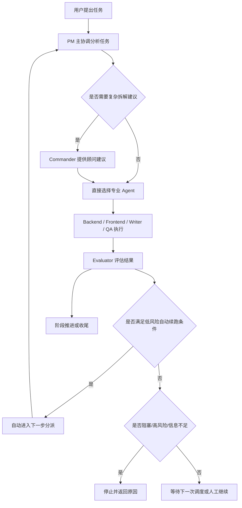
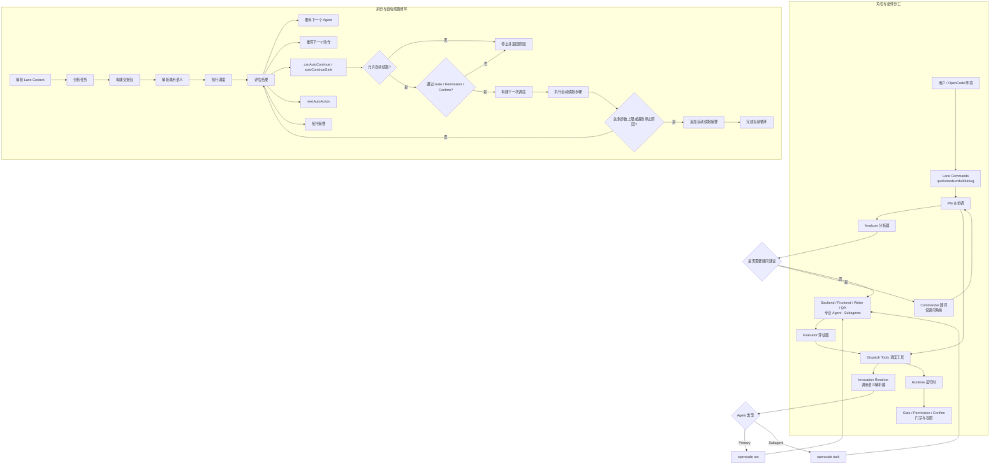

# pm-workflow 流程图设计文档

> 日期：2026-04-30（初版）/ 2026-05-07（更新至 0.1.14）  
> 状态：已落地 Mermaid 资产，持续维护  
> 范围：`opencode-pm-workflow` README 总览图、使用手册流程图、架构文档实现图

---

## 目的

本文档定义 `opencode-pm-workflow` 流程图的设计方案，确保图示准确反映当前版本（`0.1.14`）的真实实现。

### 0.1.14 版本重点更新

在 `0.1.13` 基础上，`0.1.14` 新增以下关键能力：

- **Command Lanes**：`pm-quick` / `pm-medium` / `pm-full` / `pm-debug` 四条 lane 风格入口
- **Mode-aware Dispatch**：区分 primary agent 和 subagent 的调度语义
- **Topology Summary**：单任务 / 顺序 / 并行 / 混合拓扑推断
- **Lane Context**：显式 lane 策略（risk / automation / review / topology verbosity / todo policy）
- **Invocation Semantics**：primary 走 `opencode run`，subagent 走 `opencode task`

### 核心设计原则

本轮流程图设计响应以下已确认事实：

- `pm` 是唯一主协调入口
- `commander` 不是默认主 agent，只能作为 advisor-only 角色出现
- 真正执行任务的是后端、前端、文档、QA 等专业 agent
- 工作流支持低风险条件下的受控 auto-continue
- 自动推进不绕过安全边界，仍受 `gate / permission / confirm` 约束
- Lane commands 只是 UX facade，不是第二套 runtime
- Specialist agents 保持 subagent 角色，通过 subagent-safe 路径执行

### 图层分类

本文档采用**多图分层方案**：

1. **README 总览图**：面向首次接触项目的读者，强调价值主线与角色关系
2. **使用手册流程图**：面向使用者，强调 lane 入口、调度语义、任务流转
3. **架构文档实现图**：面向维护者与开发者，强调内部调度闭环与自动续跑机制

---

## Prerequisites

### 已确认的设计约束

- 交付形式：`Mermaid + SVG`
- README 图风格：`平衡版`
- 开发图风格：`混合图`
- 本轮先完成设计文档，后续再生成 Mermaid 定稿与 SVG 成品

### 已核对的现有资产

以下现有文档与图资产已作为本设计的背景输入：

```text
docs/workflow-flow.svg
docs/runbooks/pm-workflow-usage-flow.md
docs/dev/pm-workflow-state-machine-design.md
docs/specs/2026-04-30-pm-primary-routing-and-auto-continue-design.md
docs/specs/2026-04-30-pm-primary-routing-and-auto-continue-implementation-plan.md
```

### 现有资产存在的问题

当前项目已有的流程图与使用说明存在以下偏差：

- 仍带有旧的 `plan/build` 角色叙事
- 未完整表达 `pm` 为唯一主协调入口
- 未清晰表达 `commander` 已降为 advisor-only
- 未反映 `evaluation -> auto-continue -> stop reason` 的 `0.1.13` 当前闭环
- 对执行、门禁、自动推进之间的边界表达不够准确

因此，本轮设计不是简单美化旧图，而是需要基于当前实现进行重绘。

---

## Steps

## 1. 总体设计策略

### 1.1 采用双图分层方案

本轮流程图采用：

```text
图 A：README 总览图
图 B：开发文档实现图
```

这样做的原因：

- README 需要快速传达项目价值，不能过重
- 开发文档需要完整反映内部逻辑，不能过浅
- 把两类受众混在一张图里，会同时损害可读性与准确性

### 1.2 图与文档的职责划分

```text
README 图：讲清“这个系统如何工作”
开发图：讲清“系统内部怎样决定下一步”
```

README 图偏“产品理解”，开发图偏“实现理解”。

---

## 2. 图 A：README 总览图设计

### 2.1 目标

README 总览图的目标是在较短时间内让读者理解以下几点：

- 用户任务进入系统后，首先由 `pm` 统筹
- `commander` 不再是默认总入口，而是复杂场景下的可选顾问
- 专业 agent 负责真实执行
- 结果会经过 `evaluator` 判断
- 在低风险条件下系统会自动续跑
- 在高风险、阻塞或信息不足时系统会停住并给出原因

### 2.2 目标受众

- 第一次看到该项目的用户
- 想快速理解插件定位与价值的读者
- 需要在 README 中用一张图建立整体心智模型的人

### 2.3 信息密度

README 图采用“平衡版”，不做极简，也不做技术细节堆叠。

应该明确出现的信息：

- 用户任务输入
- `pm` 主协调
- `commander advisor-only`
- 专业 agent 执行
- `evaluator`
- `auto-continue`
- 停住条件
- 阶段推进或完成

不应进入 README 图的信息：

- 具体文件名
- 具体测试名
- runtime helper 函数名
- 过细的状态枚举
- 实现层次的返回字段细节

### 2.4 Mermaid 草案（0.1.14 更新版）



### 2.5 视觉表达建议

- `pm` 节点使用更高识别度颜色，突出主协调地位
- `commander` 使用弱化色，体现顾问属性而非主路径
- `auto-continue` 路径用强调色，但要与“高风险停住”形成对照
- README 图整体保持横向或轻量纵向结构，避免过高过长

---

## 3. 图 B：开发文档实现图设计

### 3.1 目标

开发图要帮助维护者理解 `0.1.14` 的真实内部闭环，尤其是：

- `pm`、`analyzer`、`commander`、专业 agent、`evaluator`、`dispatch-tools`、`runtime`、`gate` 各自职责
- `analysis -> handoff -> execute -> evaluate` 的主链路
- `canAutoContinue`、`autoContinueSafe`、`nextAutoAction` 等信号如何进入下一跳
- 自动续跑如何在边界内运行，并在不安全时停住
- **Lane context** 如何影响调度策略
- **Primary / Subagent invocation** 如何分流执行路径

### 3.2 目标受众

- 项目维护者
- 二次开发者
- 需要理解调度闭环与自动推进边界的贡献者

### 3.3 表现形式

开发图采用“混合图”：

- 上半部分：角色与组件分工
- 下半部分：执行与自动续跑决策闭环

这样既能解释“谁负责什么”，又能解释“系统如何决定下一步”。

### 3.4 上半部分应包含的角色/组件（0.1.14 更新）

```text
用户 / OpenCode 环境
Command Lanes（pm-quick / pm-medium / pm-full / pm-debug）
pm（主协调 orchestrator）
analyzer
commander（仅顾问角色）
后端 / 前端 / 文档 / QA 专业 agent（subagents）
evaluator
dispatch-tools
runtime
gate / permission / confirm
invocation resolver（primary 与 subagent 分流）
```

### 3.5 下半部分应包含的关键步骤（0.1.14 更新）

```text
解析 lane context
分析任务
构建交接包
解析调用语义（primary 与 subagent）
执行调度（opencode run 与 opencode task）
评估结果
recommendedNextAgent
recommendedNextAction
canAutoContinue
autoContinueSafe
nextAutoAction
构建下一次调度
执行自动续跑步骤
追加自动续跑摘要
拓扑摘要（single / sequential / parallel / hybrid）
停止并返回原因
```

### 3.6 Mermaid 草案（0.1.14 更新版）



### 3.7 视觉表达建议

- 上半部分突出职责边界，下半部分突出执行闭环
- `commander` 在位置与色彩上都应低于 `pm`
- `gate / permission / confirm` 要放在自动续跑链路的关键交界处，避免误读为“自动推进绕过安全检查”
- “停止并返回原因”节点要足够醒目，体现“可停止、可解释”的设计原则

---

## 4. 文档与资产落点建议

### 4.1 Mermaid 源码建议落点

建议将两张图的 Mermaid 源码放入文档中，或单独拆分到专门的 Markdown 文件中，以便后续维护。

推荐方向：

```text
docs/runbooks/pm-workflow-usage-flow.md
docs/dev/pm-workflow-routing-and-auto-continue.md
```

其中：

- README 图更适合放在 `runbooks` 或 README 引用路径中
- 开发图更适合新增一篇开发文档，而不是强塞进旧的状态机文档

### 4.2 SVG 成品建议落点

建议 SVG 至少拆成两份，而不是继续只保留一个总图：

```text
docs/pm-workflow-overview.svg
docs/pm-workflow-routing-auto-continue.svg
```

这样可以避免单文件同时服务两类受众而导致内容混乱。

### 4.3 对旧资产的处理建议

旧资产 `docs/workflow-flow.svg` 不建议继续直接覆盖为“大而全”的版本。

推荐两种后续处理方式中的一种：

1. 用新的 README 总览图替换它，并把开发图单独新增
2. 保留旧文件作为历史资产，新图使用更明确的新命名

从可维护性角度看，更推荐第 2 种，因为新命名更能体现职责边界。

---

## 5. 验收标准

本轮流程图设计完成后，应满足以下验收标准：

1. README 图必须明确表达 `pm` 是唯一主协调入口。
2. README 图必须明确表达 `commander` 只是 advisor-only，而非默认总入口。
3. README 图必须表达“可受控 auto-continue”与“高风险停住”这两个对照关系。
4. 开发图必须展示“分析 -> 交接 -> 执行 -> 评估”主闭环。
5. 开发图必须展示自动续跑信号与安全边界，而不是只画推荐下一步。
6. 两张图都不能误导读者以为自动推进绕过 `gate / permission / confirm`。
7. Mermaid 版本与 SVG 版本的语义必须保持一致。

---

## Examples

### 例 1：README 图应该传达的用户认知

```text
用户提出任务
-> pm 判断是否需要顾问建议
-> 分派给专业 agent
-> evaluator 判断能否自动进入下一步
-> 低风险则自动推进，否则停住并返回原因
```

### 例 2：开发图应该传达的维护者认知

```text
analyzer 负责识别任务特征
evaluator 负责输出下一步建议与自动续跑信号
runtime 负责构建下一跳 dispatch
dispatch-tools 负责执行链汇总与回显
gate / permission / confirm 负责拦截不安全推进
```

---

## FAQ

### 为什么不继续只维护一张图？

因为 README 与开发文档面对的是不同受众。把两类需求塞进同一张图，会让总览图过重，也会让开发图不够细。

### 为什么 README 图不直接展示实现字段？

README 的职责是建立系统心智模型，而不是解释内部返回结构。实现字段更适合放在开发图和对应设计文档中。

### 为什么要特别强调 `commander advisor-only`？

因为这是本轮架构调整的核心变化之一。如果图里不强调，读者容易继续沿用旧理解，把 `commander` 误认为默认总调度入口。

### 为什么要突出 stop reason？

因为当前系统的自动化目标不是“尽可能多跑”，而是“在可解释边界内推进”。停住条件本身就是设计的一部分。

---

## Troubleshooting

### 问题 1：图画出来后仍显得像旧工作流

排查方向：

- 是否仍在主路径上突出 `commander`
- 是否没有把 `pm` 放在唯一入口位置
- 是否没有表现 auto-continue 与 stop 的对照关系

### 问题 2：README 图信息过密

处理方式：

- 删除实现字段名
- 合并专业 agent 节点
- 只保留一条 auto-continue 主线

### 问题 3：开发图读起来像时序图但缺少决策逻辑

处理方式：

- 把决策菱形节点补齐
- 增加 `canAutoContinue / autoContinueSafe / nextAutoAction`
- 增加“停止并返回原因”终止节点

---

## Change Log

| 日期 | 版本 | 变更 |
|---|---|---|
| 2026-05-07 | 0.1.14 | 更新到 0.1.14：新增 Command Lanes、Mode-aware Dispatch、Topology Summary、Lane Context、Invocation Semantics；所有流程图改为中文标签。 |
| 2026-04-30 | 0.1.13 | 初版：定义双图分层方案，明确 PM 主协调入口、Commander advisor-only、Auto-continue 与 Stop reason 对照关系。 |
| 2026-04-30 | 1.0 | 初版双图分层设计，覆盖 README 总览图与开发文档实现图 |
