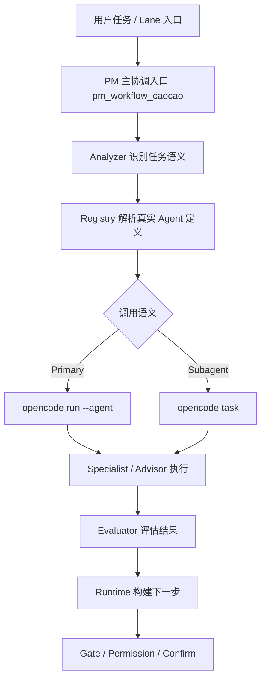
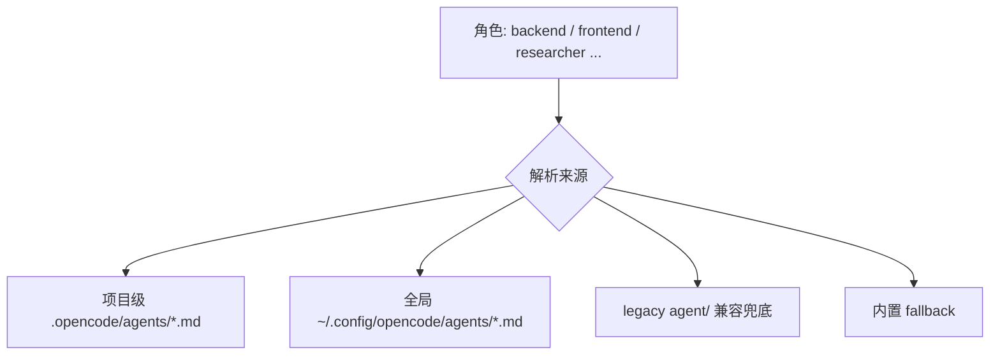
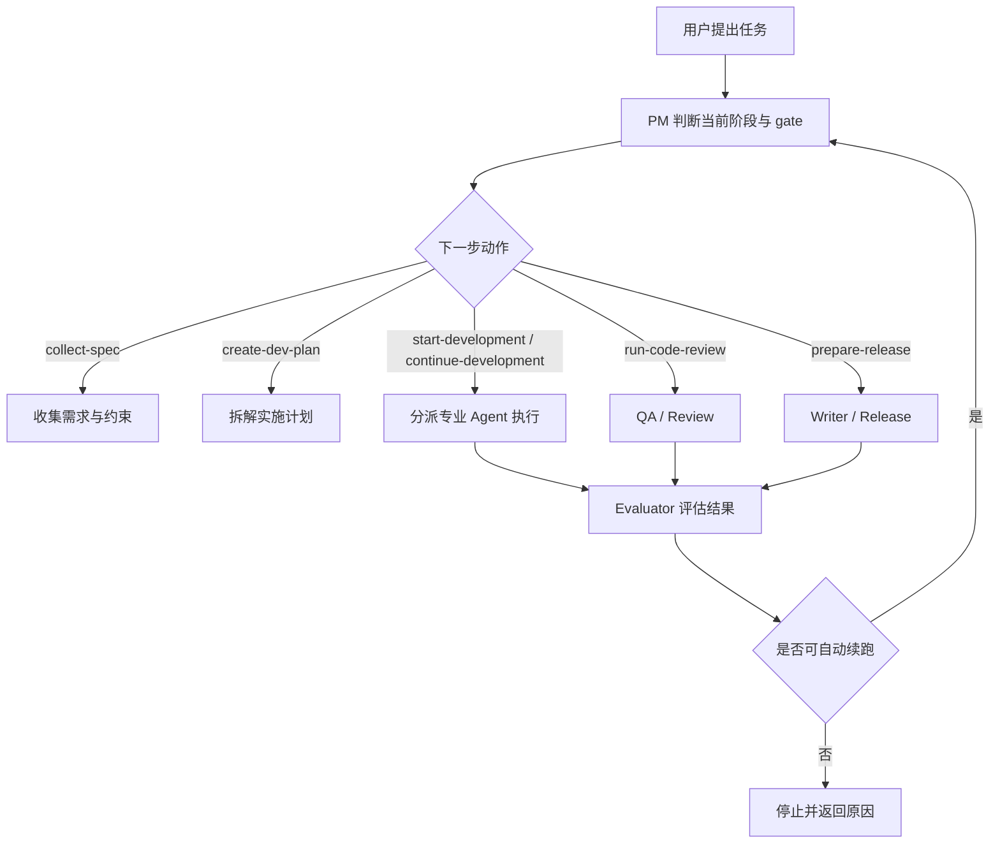

# Documentation Consolidation Implementation Plan

> **For agentic workers:** REQUIRED SUB-SKILL: Use superpowers:subagent-driven-development (recommended) or superpowers:executing-plans to implement this plan task-by-task. Steps use checkbox (`- [ ]`) syntax for tracking.

**Goal:** 将仓库现有文档收敛为 README + 4 篇主文档，并删除大部分重复、过时、碎片化旧文档与散落流程图说明。

**Architecture:** 先盘点现有文档并建立“保留/吸收/删除”映射，再重写 4 篇主文档与 README，最后统一流程图、清理旧目录入口并验证最终文档总量与内容一致性。文档内容按“当前真实机制”组织：技术架构、业务流转、使用运维、待办演进，而不是按历史 spec/plan/migration 组织。

**Tech Stack:** Markdown、Mermaid、git、npm（仅用于必要验证）

---

## 文件结构与职责映射

### 新建文件

- `docs/01-技术架构.md`：当前真实技术架构、任务域/角色边界、Analyzer/Registry/Runtime 分层、primary/subagent 调度、架构图。
- `docs/02-业务功能与任务流转.md`：阶段机、dispatch、lane 业务语义、auto-continue、业务流程图。
- `docs/03-使用与运维手册.md`：安装接入、配置、常用工具、诊断、发布、FAQ。
- `docs/04-待办与演进清单.md`：当前已完成、边界约束、未完成事项、后续演进路线。

### 重写文件

- `README.md`：压缩为项目总入口，只保留定位、接入、核心原则、文档导航。

### 主要信息来源

- `docs/dev/pm-workflow-architecture-overview.md`
- `docs/dev/pm-workflow-routing-and-auto-continue.md`
- `docs/runbooks/pm-workflow-usage-flow.md`
- `docs/dev/command-lane-mapping.md`
- `docs/dev/subagent-dispatch-migration.md`
- `docs/dev/pm-workflow-plugin-usage.md`
- `docs/dev/pm-workflow-state-machine-design.md`
- `docs/dev/pm-workflow-plugin-publish-checklist.md`
- `docs/dev/pm-workflow-plugin-release-readiness.md`
- `docs/dev/pm-workflow-plugin-release-notes-draft.md`
- `docs/dev/pm-workflow-plugin-migration-summary.md`
- `docs/dev/pm-workflow-compatibility-audit.md`
- `docs/dev/opencode-pm-workflow-and-session-status.md`
- `docs/specs/2026-04-30-pm-workflow-diagrams-design.md`

### 预期删除对象

- `docs/dev/*.md` 中被主文档完全吸收的文件
- `docs/runbooks/pm-workflow-usage-flow.md`
- `docs/specs/*.md` 中仅剩历史设计参考价值、且已被主文档吸收的文件
- `docs/superpowers/specs/*.md` 与 `docs/superpowers/plans/*.md` 中除当前文档收敛 spec/plan 外的大部分历史文档

---

### Task 1: 建立文档盘点与删除映射

**Files:**
- Modify: `docs/superpowers/plans/2026-05-09-documentation-consolidation-implementation-plan.md`
- Review: `docs/`, `README.md`

- [ ] **Step 1: 列出现有文档清单并按主题分组**

执行人工盘点，至少覆盖以下组别：

```text
README
docs/dev/*.md
docs/runbooks/*.md
docs/specs/*.md
docs/superpowers/specs/*.md
docs/superpowers/plans/*.md
```

输出格式写入当前 plan 的执行记录或工作笔记：

```text
保留并重写：README.md
新建主文档：docs/01-技术架构.md ... docs/04-待办与演进清单.md
吸收后删除：<file list>
保留历史最小集合：仅当前 documentation consolidation 的 spec + plan
```

- [ ] **Step 2: 人工确认最终主文档职责不重叠**

检查以下职责边界是否成立：

```text
README = 总入口
01 = 技术架构
02 = 业务功能与任务流转
03 = 使用与运维
04 = 待办与演进清单
```

如果发现某主题会重复出现，按以下规则裁剪：

```text
实现分层、agent registry、调用语义 -> 01
阶段流转、lane 业务选择、auto-continue 语义 -> 02
安装、配置、命令、发布、FAQ -> 03
未完成项、治理约束、后续计划 -> 04
```

- [ ] **Step 3: 快速自检映射是否满足“≤5 篇主文档”目标**

人工检查结果必须满足：

```text
README.md
docs/01-技术架构.md
docs/02-业务功能与任务流转.md
docs/03-使用与运维手册.md
docs/04-待办与演进清单.md
```

不得再新增第 6 篇现行主文档。

- [ ] **Step 4: Commit**

```bash
git add docs/superpowers/plans/2026-05-09-documentation-consolidation-implementation-plan.md
git commit -m "docs: add documentation consolidation plan"
```

### Task 2: 重写 README 为项目唯一总入口

**Files:**
- Modify: `README.md`
- Reference: `docs/dev/pm-workflow-architecture-overview.md`, `docs/runbooks/pm-workflow-usage-flow.md`

- [ ] **Step 1: 先写 README 结构草稿**

将 `README.md` 改写为以下结构：

```md
# @walke/opencode-pm-workflow

## 项目定位
## 核心能力
## 安装
## OpenCode 接入
## 核心工作流原则
## 当前文档结构
## 发布前验证
## 发布
```

其中“当前文档结构”只列 4 篇主文档：

```md
- `docs/01-技术架构.md`
- `docs/02-业务功能与任务流转.md`
- `docs/03-使用与运维手册.md`
- `docs/04-待办与演进清单.md`
```

- [ ] **Step 2: 删除 README 中过深的内部实现展开**

从 README 中移除或压缩以下类型内容，仅保留简明结论并跳转到主文档：

```text
过长的角色表
过深的 dispatch/lane 细节
过多的 tool 分类说明
与 01/02/03 重复的大段架构与流程文字
```

README 应保留的核心句式示例：

```md
`pm-workflow` 采用“稳定任务域 + 外部 agent 定义绑定”的双层模型。

- `pm_workflow_caocao` 是统一主协调入口
- command lanes 是 UX facade，不是第二套 runtime
- Analyzer 负责语义判断，Registry 负责 agent 定义绑定，Runtime 负责执行编排
```

- [ ] **Step 3: 检查 README 是否能独立回答首次接入问题**

人工检查以下问题是否能直接从 README 得到答案：

```text
这是什么项目？
怎么安装？
怎么接入 OpenCode？
核心机制是什么？
去哪里看架构/流程/使用说明？
怎么做发布前验证？
```

- [ ] **Step 4: Commit**

```bash
git add README.md
git commit -m "docs: rewrite README as canonical entry"
```

### Task 3: 新建《01-技术架构》并合并技术设计文档

**Files:**
- Create: `docs/01-技术架构.md`
- Reference: `docs/dev/pm-workflow-architecture-overview.md`
- Reference: `docs/dev/pm-workflow-routing-and-auto-continue.md`
- Reference: `docs/dev/command-lane-mapping.md`
- Reference: `docs/dev/subagent-dispatch-migration.md`
- Reference: `docs/dev/pm-workflow-state-machine-design.md`

- [ ] **Step 1: 写出技术架构文档骨架**

创建以下 Markdown 骨架：

```md
# pm-workflow 技术架构

## 1. 架构目标与原则
## 2. 核心任务域与角色边界
## 3. 总体分层：Analyzer / Registry / Runtime / Evaluator / Gate
## 4. Command Lane 与统一 Runtime 的关系
## 5. Primary / Subagent 调度语义
## 6. Agent 定义来源与优先级
## 7. 关键流程图
## 8. 当前架构约束
```

- [ ] **Step 2: 合并并统一当前真实机制说明**

正文必须明确写入以下结论：

```text
workflow 识别的是稳定工作类型，而不是 agent 文件名
新增 agent 不等于新增语义角色
项目级 .opencode/agents 优先于全局级 ~/.config/opencode/agents
legacy agent/ 仅为兼容兜底
pm_workflow_caocao 是唯一 primary orchestrator
specialist 若为 subagent，必须走 subagent-safe 路径
command lanes 是 facade，不是第二套 engine
```

- [ ] **Step 3: 绘制并嵌入两张核心 Mermaid 图**

第一张图：总体架构图。



第二张图：agent 定义优先级图。



- [ ] **Step 4: 进行架构约束自检**

人工核对文档中是否明确限制了以下坏设计：

```text
新增 agent 文件直接扩张核心任务域
按模型差异新增语义角色
Runtime 二次做语义分类
多处重复维护角色真相
```

- [ ] **Step 5: Commit**

```bash
git add docs/01-技术架构.md
git commit -m "docs: consolidate technical architecture guide"
```

### Task 4: 新建《02-业务功能与任务流转》并合并流程文档

**Files:**
- Create: `docs/02-业务功能与任务流转.md`
- Reference: `docs/runbooks/pm-workflow-usage-flow.md`
- Reference: `docs/dev/pm-workflow-routing-and-auto-continue.md`
- Reference: `docs/dev/command-lane-mapping.md`

- [ ] **Step 1: 写出业务流转文档骨架**

创建以下结构：

```md
# pm-workflow 业务功能与任务流转

## 1. 解决什么问题
## 2. 核心业务能力
## 3. 阶段模型与 gate
## 4. dispatch 动作与推荐下一步
## 5. lane 的业务选择方式
## 6. auto-continue 与停止条件
## 7. 复合任务编排方式
## 8. 任务流转流程图
```

- [ ] **Step 2: 明确业务视角的角色边界**

至少写清以下区分：

```text
plan = 怎么推进
researcher = 外部怎么做
tech-lead = 方案本身好不好
frontend/backend = 实现
writer = 文档与发布说明
qa = 测试与验证
```

- [ ] **Step 3: 绘制并嵌入业务任务流转图**

插入以下 Mermaid 图并按正文解释：



- [ ] **Step 4: 写清 auto-continue 的业务边界**

正文必须包含以下判断原则：

```text
自动续跑是受控延续，不是绕过 gate
需要同时满足 evaluator 建议与 gate/permission/confirm
高风险、阻塞、信息不足时应停住并返回原因
```

- [ ] **Step 5: Commit**

```bash
git add docs/02-业务功能与任务流转.md
git commit -m "docs: consolidate workflow and business flow guide"
```

### Task 5: 新建《03-使用与运维手册》并合并操作文档

**Files:**
- Create: `docs/03-使用与运维手册.md`
- Reference: `docs/dev/pm-workflow-plugin-usage.md`
- Reference: `docs/dev/pm-workflow-plugin-publish-checklist.md`
- Reference: `docs/dev/pm-workflow-plugin-release-readiness.md`
- Reference: `docs/dev/pm-workflow-plugin-release-notes-draft.md`
- Reference: `docs/dev/pm-workflow-plugin-migration-summary.md`
- Reference: `docs/dev/pm-workflow-compatibility-audit.md`

- [ ] **Step 1: 写出使用与运维文档骨架**

创建以下结构：

```md
# pm-workflow 使用与运维手册

## 1. 安装与插件接入
## 2. 目录与配置文件
## 3. 常用 pm-* tools
## 4. 推荐操作顺序
## 5. 诊断与排障
## 6. 发布前验证
## 7. 发布流程
## 8. FAQ
```

- [ ] **Step 2: 将零散操作说明压缩为少量高价值章节**

正文至少应覆盖：

```text
插件入口 server/tui 的接入方式
.pm-workflow/config.json 与全局配置位置
常用工具：state/gate/dispatch/execute/doctor
推荐顺序：pm-check-gates -> pm-dry-run-dispatch -> pm-execute-dispatch
发布前验证：npm run verify-release
发布：npm publish 与 npm view version
```

- [ ] **Step 3: 加入一张“常用动作路径图”**


- [ ] **Step 4: 删除明显过时的 package-first 历史叙述**

删除或改写以下类型描述：

```text
packages/opencode-pm-workflow/ 旧目录假设
已过时的“尚未发布”判断
与当前 0.1.17 事实不符的待确认项
```

用当前事实替换：

```text
当前发布版本为 0.1.17
包名为 @walke/opencode-pm-workflow
当前主仓库即该发布包仓库
verify-release 为推荐发布前验证入口
```

- [ ] **Step 5: Commit**

```bash
git add docs/03-使用与运维手册.md
git commit -m "docs: consolidate usage and operations manual"
```

### Task 6: 新建《04-待办与演进清单》并整理当前真实状态

**Files:**
- Create: `docs/04-待办与演进清单.md`
- Reference: `README.md`
- Reference: `docs/superpowers/specs/2026-05-09-documentation-consolidation-design.md`

- [ ] **Step 1: 写出待办与演进文档骨架**

创建以下结构：

```md
# pm-workflow 待办与演进清单

## 1. 当前状态摘要
## 2. 已完成能力
## 3. 已确认边界
## 4. 当前待办
## 5. 中期演进方向
## 6. 文档治理与架构治理规则
```

- [ ] **Step 2: 写入当前已完成事实**

至少覆盖以下项目：

```text
lane-aware orchestration
mode-aware dispatch
compact handoff
agent definition registry
researcher routing
npm 0.1.17 发布
```

- [ ] **Step 3: 写入已确认边界与禁止扩张规则**

正文必须写清：

```text
核心任务域保持少量稳定
新增 agent 不自动扩张语义角色
优先优化已有边界，不优先加新角色
tech-lead 若存在，只能作为评审型角色窄定义存在
```

- [ ] **Step 4: 写出当前待办清单，避免空泛路线图**

待办项使用复选框并尽量具体，例如：

```md
- [ ] 继续补强 researcher 与其他角色的边界回归样例
- [ ] 明确 tech-lead 是否进入核心任务域，以及是否只保留审查语义
- [ ] 收敛主文档后的引用检查与路径校验
- [ ] 评估是否还需要保留少量 superpowers 文档用于内部开发流程
```

- [ ] **Step 5: Commit**

```bash
git add docs/04-待办与演进清单.md
git commit -m "docs: add roadmap and governance checklist"
```

### Task 7: 删除旧文档并清理目录入口

**Files:**
- Delete: `docs/dev/*.md`（被吸收者）
- Delete: `docs/runbooks/pm-workflow-usage-flow.md`
- Delete: `docs/specs/*.md`（被吸收者）
- Delete: `docs/superpowers/specs/*.md`（保留当前 consolidation spec 之外的大部分历史文档）
- Delete: `docs/superpowers/plans/*.md`（保留当前 consolidation plan 之外的大部分历史文档）

- [ ] **Step 1: 逐项删除已被吸收的现行旧文档**

优先删除以下明确已被新主文档吸收的文件：

```text
docs/dev/pm-workflow-architecture-overview.md
docs/dev/pm-workflow-routing-and-auto-continue.md
docs/runbooks/pm-workflow-usage-flow.md
docs/dev/command-lane-mapping.md
docs/dev/subagent-dispatch-migration.md
docs/dev/pm-workflow-plugin-usage.md
docs/dev/pm-workflow-state-machine-design.md
docs/dev/pm-workflow-plugin-publish-checklist.md
docs/dev/pm-workflow-plugin-release-readiness.md
docs/dev/pm-workflow-plugin-release-notes-draft.md
docs/dev/pm-workflow-plugin-migration-summary.md
docs/dev/pm-workflow-compatibility-audit.md
```

- [ ] **Step 2: 删除多余历史 spec/plan 文档，保留最小必要集合**

默认保留：

```text
docs/superpowers/specs/2026-05-09-documentation-consolidation-design.md
docs/superpowers/plans/2026-05-09-documentation-consolidation-implementation-plan.md
```

其余历史 spec/plan 若不再为当前仓库提供现行真相，直接删除。

- [ ] **Step 3: 检查 README 与 4 篇主文档中是否还引用已删除路径**

人工检查每个文档中的路径引用，确保没有残留：

```text
docs/dev/
docs/runbooks/
docs/specs/
docs/superpowers/specs/旧文档
docs/superpowers/plans/旧文档
```

- [ ] **Step 4: Commit**

```bash
git add README.md docs
git commit -m "docs: remove obsolete documentation set"
```

### Task 8: 最终复核与验证

**Files:**
- Review: `README.md`
- Review: `docs/01-技术架构.md`
- Review: `docs/02-业务功能与任务流转.md`
- Review: `docs/03-使用与运维手册.md`
- Review: `docs/04-待办与演进清单.md`

- [ ] **Step 1: 统计现行主文档数量**

人工确认最终主文档仅有：

```text
README.md
docs/01-技术架构.md
docs/02-业务功能与任务流转.md
docs/03-使用与运维手册.md
docs/04-待办与演进清单.md
```

- [ ] **Step 2: 逐篇检查流程图与正文一致性**

每篇包含 Mermaid 的文档都要检查：

```text
图中角色名称是否与正文一致
Primary/Subagent 路径是否与当前机制一致
是否仍出现旧版 commander 主入口叙述
是否仍出现“多文档并存”的旧导航方式
```

- [ ] **Step 3: 快速验证 Markdown 目录与链接可读性**

人工执行以下检查：

```text
README 导航能跳到 4 篇主文档
4 篇主文档标题层级清晰
没有明显残留英文半成品标题
没有“待补充/TODO/后续再写”占位语
```

- [ ] **Step 4: Commit**

```bash
git add README.md docs
git commit -m "docs: finalize consolidated documentation set"
```

## Self-Review

- 本计划覆盖了 spec 中要求的 5 篇主文档、流程图统一、旧文档删除与当前机制对齐。
- 计划中未使用 TBD / TODO / “后续补充” 之类占位作为步骤内容。
- 各任务使用的文件路径与目标文档结构保持一致：README + `docs/01-04` + 删除旧文档。
